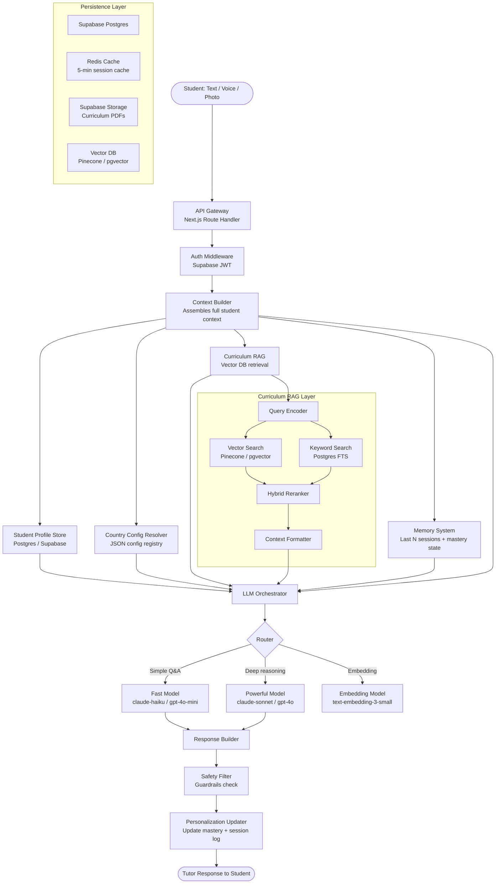

# Country-Adaptive One-to-One Tutor LLM
## Complete Technical Specification
### Implementation-Ready for Engineering Teams

---

## TABLE OF CONTENTS

1. System Architecture
2. Student Profile
3. Country Configuration System
4. LLM Routing
5. Master System Prompt
6. Country-Specific Teaching Behavior
7. Multilingual Support
8. Curriculum RAG
9. Personalization Engine
10. Active Recall + Teaching Loop
11. One-to-One Voice Tutor
12. Camera / Study Monitoring
13. Safety
14. Database Design
15. API Design
16. LLM Provider Abstraction
17. Cost Optimization
18. Implementation Roadmap
19. Project File Structure

---

## 1. SYSTEM ARCHITECTURE

### Architecture Overview

The system follows a layered architecture where every layer has one job:
- **Edge layer**: receives student input
- **Context layer**: determines who this student is and what they need
- **Orchestration layer**: decides which tools to use
- **LLM layer**: generates the actual response
- **Persistence layer**: stores everything



### How Components Communicate

| From | To | Protocol | What's Sent |
|---|---|---|---|
| Frontend | API Gateway | HTTPS REST / WebSocket | Student message + session token |
| API Gateway | Context Builder | In-process function call | Verified user ID |
| Context Builder | Postgres | Supabase client | Read student_profile, mastery |
| Context Builder | Country Config | In-memory JSON registry | country_code lookup |
| Context Builder | Vector DB | HTTP (Pinecone) / SQL (pgvector) | Embedded query |
| Context Builder | Redis | Redis client | Read/write 5-min session cache |
| Orchestrator | LLM | HTTP (Anthropic/OpenAI) | Assembled prompt + context |
| LLM | Safety Filter | In-process | Raw LLM response |
| Safety Filter | Personalization Updater | In-process | Approved response |
| Personalization Updater | Postgres | Supabase client | Write session + updated mastery |

---

## 2. STUDENT PROFILE

### TypeScript Interface

```typescript
interface StudentProfile {
  // ─── Identity ────────────────────────────────────────────────
  id: string                    // UUID, system-generated
  userId: string                // Auth user ID
  name: string                  // Provided by student
  age: number                   // Provided by student
  createdAt: Date
  updatedAt: Date

  // ─── Location & Education System ─────────────────────────────
  country: string               // ISO 3166-1 alpha-2 (e.g. "NP", "IN", "US", "GB")
  region: string | null         // State/province (e.g. "Maharashtra", "Texas")
  educationSystem: string       // e.g. "NEB", "CBSE", "COMMON_CORE", "GCSE", "NCTB"
  curriculum: string            // e.g. "NEB_GRADE10", "CBSE_CLASS10"
  grade: string                 // Normalized (e.g. "10") or system-specific ("Year 10")
  gradeDisplay: string          // How to show it locally ("Class 10", "Grade 10", "Year 10")
  schoolType: 'public' | 'private' | 'international' | 'home'
  examBoard: string             // e.g. "SEE", "CBSE_BOARD", "GCSE_AQA", "SSC"

  // ─── Subjects ────────────────────────────────────────────────
  activeSubjects: StudentSubject[]
  primarySubject: string | null // Currently selected for this session

  // ─── Language ────────────────────────────────────────────────
  preferredLanguage: string     // BCP-47 (e.g. "ne", "hi", "en-US", "bn")
  secondaryLanguage: string | null
  curriculumLanguage: string    // Language of the actual curriculum docs

  // ─── Learning Profile ─────────────────────────────────────────
  learningStyle: 'visual' | 'auditory' | 'reading' | 'kinesthetic' | 'mixed'
  pace: 'slow' | 'standard' | 'fast'
  difficultyPreference: 'easier' | 'matched' | 'challenging'
  teachingStyle: 'socratic' | 'direct' | 'collaborative' | 'adaptive'
  sessionLengthMinutes: number  // Preferred session length

  // ─── Academic State ───────────────────────────────────────────
  overallLevel: 'beginner' | 'intermediate' | 'advanced'
  strengths: string[]           // e.g. ["algebra", "vocabulary"]
  weaknesses: string[]          // e.g. ["trigonometry", "essay_structure"]
  misconceptions: Misconception[]
  monthlyGoal: string | null    // Student-stated goal
  examDate: Date | null
  examTarget: string | null     // e.g. "GPA 3.6 in SEE"

  // ─── System-Inferred (not shown to student as raw data) ───────
  baselineScore: number | null  // 0-100, from onboarding quiz
  currentEstimatedLevel: number // 0-100, system tracks this
  sessionCount: number
  totalStudyMinutes: number
  lastSessionAt: Date | null
  masteryByTopic: MasteryMap    // { topicId: 0-1 }
  retentionScore: number        // 0-1, how well they retain across sessions
  engagementScore: number       // 0-1, how actively they respond
}

interface StudentSubject {
  subjectId: string
  subjectName: string           // Localized to their curriculum
  masteryLevel: number          // 0-1
  completedTopics: string[]
  currentTopic: string | null
  nextReviewAt: Date | null
}

interface Misconception {
  topicId: string
  description: string
  detectedAt: Date
  correctedAt: Date | null
}

type MasteryMap = Record<string, number>  // topicId → 0 to 1
```

### Which Fields Are Explicitly Provided vs Inferred

| Field | Source | Notes |
|---|---|---|
| name, age, country, grade | Student at onboarding | Direct questions |
| subjects, exam board | Student at onboarding | Dropdown from country config |
| preferredLanguage | Student at onboarding | Defaults to country primary language |
| monthlyGoal, examDate | Student at onboarding | Free text |
| learningStyle, pace | Student preference questions | Can be changed later |
| educationSystem, curriculum | **Inferred from country + grade** | Looked up from country config |
| gradeDisplay | **Inferred** | Formatted by country config |
| baselineScore | **System** | Onboarding quiz result |
| masteryByTopic | **System** | Updated every session |
| misconceptions | **System** | Detected by LLM during sessions |
| currentEstimatedLevel | **System** | Computed from mastery map |
| retentionScore, engagementScore | **System** | Computed from session history |
| weaknesses, strengths | **System** | Derived from mastery map |

---

## 3. COUNTRY CONFIGURATION SYSTEM

### Configuration Schema (TypeScript)

```typescript
interface CountryConfig {
  // ─── Identity ────────────────────────────────────────────────
  countryCode: string           // ISO 3166-1 alpha-2
  countryName: string
  region: string | null         // e.g. "South Asia"

  // ─── Education Systems ────────────────────────────────────────
  educationSystems: EducationSystem[]
  defaultEducationSystem: string

  // ─── Language ────────────────────────────────────────────────
  primaryLanguage: string       // BCP-47
  additionalLanguages: string[]
  curriculumLanguage: string

  // ─── Terminology ─────────────────────────────────────────────
  terminology: {
    gradeLabel: string          // "Grade", "Class", "Year", "Form"
    studentLabel: string        // "Student", "Pupil", "Learner"
    teacherLabel: string        // "Teacher", "Tutor", "Sir/Ma'am"
    examLabel: string           // "Exam", "Test", "Assessment", "Paper"
    markLabel: string           // "Marks", "Score", "Grade", "Points"
    passingTerm: string         // "Pass", "Distinction"
    failingTerm: string         // "Fail", "Refer", "Unsatisfactory"
  }

  // ─── Academic Context ─────────────────────────────────────────
  gradingSystem: GradingSystem
  academicYear: {
    startMonth: number          // 1-12
    endMonth: number
    structure: 'semester' | 'trimester' | 'annual' | 'term'
  }

  // ─── Formatting & Units ───────────────────────────────────────
  numberFormat: {
    decimalSeparator: '.' | ','
    thousandsSeparator: ',' | '.' | ' '
    currencySymbol: string
    currencyCode: string        // ISO 4217
    currencyName: string
  }
  measurementSystem: 'metric' | 'imperial' | 'mixed'
  dateFormat: string            // e.g. "DD/MM/YYYY", "MM/DD/YYYY"

  // ─── Teaching Conventions ─────────────────────────────────────
  teachingConventions: {
    preferSocratic: boolean
    preferDirectInstruction: boolean
    culturalFormalityLevel: 'formal' | 'semi-formal' | 'informal'
    parentInvolvementExpected: boolean
    memorisationEmphasis: 'high' | 'medium' | 'low'
    spellingVariant: 'en-US' | 'en-GB' | 'en-AU' | null
  }
}

interface EducationSystem {
  id: string                    // e.g. "NEB", "CBSE", "COMMON_CORE"
  name: string
  gradeStructure: GradeLevel[]
  subjects: SubjectDefinition[]
  examSystems: ExamSystem[]
}

interface GradeLevel {
  grade: string                 // Normalized e.g. "10"
  displayName: string           // e.g. "Class 10", "Year 10", "Grade 10"
  ageRange: { min: number; max: number }
  level: 'primary' | 'lower_secondary' | 'upper_secondary' | 'higher_secondary'
}

interface ExamSystem {
  id: string                    // e.g. "SEE", "CBSE_BOARD"
  name: string
  fullName: string
  grades: string[]              // Which grades this exam applies to
  format: 'written' | 'oral' | 'practical' | 'mixed'
  gradingSystem: string         // Reference to grading system
}

interface GradingSystem {
  type: 'letter' | 'percentage' | 'gpa' | 'marks' | 'grade_point' | 'descriptive'
  scale: GradeScale[]
  passingThreshold: number
}

interface GradeScale {
  label: string                 // e.g. "A+", "Distinction", "Pass"
  minScore: number
  maxScore: number
  gradePoint?: number
  description: string
}

interface SubjectDefinition {
  id: string
  name: string                  // Canonical name in curriculum language
  localName: string             // Local language name
  grades: string[]
  type: 'compulsory' | 'elective'
  weeklyHours?: number
}
```

### Example: Nepal Configuration

```json
{
  "countryCode": "NP",
  "countryName": "Nepal",
  "region": "South Asia",
  "educationSystems": [
    {
      "id": "NEB",
      "name": "National Examinations Board",
      "gradeStructure": [
        { "grade": "9",  "displayName": "Grade 9",  "ageRange": { "min": 14, "max": 16 }, "level": "lower_secondary" },
        { "grade": "10", "displayName": "Grade 10", "ageRange": { "min": 15, "max": 17 }, "level": "lower_secondary" },
        { "grade": "11", "displayName": "Grade 11", "ageRange": { "min": 16, "max": 18 }, "level": "upper_secondary" },
        { "grade": "12", "displayName": "Grade 12", "ageRange": { "min": 17, "max": 19 }, "level": "upper_secondary" }
      ],
      "subjects": [
        { "id": "NP_MATH",    "name": "Compulsory Mathematics", "localName": "अनिवार्य गणित",    "grades": ["9","10"], "type": "compulsory" },
        { "id": "NP_SCI",     "name": "Science",                "localName": "विज्ञान",          "grades": ["9","10"], "type": "compulsory" },
        { "id": "NP_ENG",     "name": "English",                "localName": "अंग्रेजी",         "grades": ["9","10"], "type": "compulsory" },
        { "id": "NP_NEP",     "name": "Nepali",                 "localName": "नेपाली",           "grades": ["9","10"], "type": "compulsory" },
        { "id": "NP_SS",      "name": "Social Studies and Life Skills", "localName": "सामाजिक अध्ययन", "grades": ["9","10"], "type": "compulsory" }
      ],
      "examSystems": [
        {
          "id": "SEE",
          "name": "SEE",
          "fullName": "Secondary Education Examination",
          "grades": ["10"],
          "format": "written",
          "gradingSystem": "NP_GPA"
        }
      ]
    }
  ],
  "defaultEducationSystem": "NEB",
  "primaryLanguage": "ne",
  "additionalLanguages": ["en"],
  "curriculumLanguage": "ne",
  "terminology": {
    "gradeLabel": "Grade",
    "studentLabel": "Student",
    "teacherLabel": "Teacher",
    "examLabel": "Exam",
    "markLabel": "Marks",
    "passingTerm": "Pass",
    "failingTerm": "Fail"
  },
  "gradingSystem": {
    "type": "grade_point",
    "scale": [
      { "label": "A+", "minScore": 90, "maxScore": 100, "gradePoint": 4.0, "description": "Outstanding" },
      { "label": "A",  "minScore": 80, "maxScore": 89,  "gradePoint": 3.6, "description": "Excellent" },
      { "label": "B+", "minScore": 70, "maxScore": 79,  "gradePoint": 3.2, "description": "Very Good" },
      { "label": "B",  "minScore": 60, "maxScore": 69,  "gradePoint": 2.8, "description": "Good" },
      { "label": "C+", "minScore": 50, "maxScore": 59,  "gradePoint": 2.4, "description": "Satisfactory" },
      { "label": "C",  "minScore": 40, "maxScore": 49,  "gradePoint": 2.0, "description": "Acceptable" },
      { "label": "D",  "minScore": 35, "maxScore": 39,  "gradePoint": 1.6, "description": "Partially Acceptable" },
      { "label": "NG", "minScore": 0,  "maxScore": 34,  "gradePoint": 0.0, "description": "Not Graded" }
    ],
    "passingThreshold": 35
  },
  "academicYear": { "startMonth": 4, "endMonth": 3, "structure": "annual" },
  "numberFormat": {
    "decimalSeparator": ".",
    "thousandsSeparator": ",",
    "currencySymbol": "Rs.",
    "currencyCode": "NPR",
    "currencyName": "Nepalese Rupee"
  },
  "measurementSystem": "metric",
  "dateFormat": "YYYY/MM/DD",
  "teachingConventions": {
    "preferSocratic": false,
    "preferDirectInstruction": true,
    "culturalFormalityLevel": "formal",
    "parentInvolvementExpected": true,
    "memorisationEmphasis": "high",
    "spellingVariant": "en-GB"
  }
}
```

### Example: India Configuration

```json
{
  "countryCode": "IN",
  "countryName": "India",
  "region": "South Asia",
  "educationSystems": [
    {
      "id": "CBSE",
      "name": "Central Board of Secondary Education",
      "gradeStructure": [
        { "grade": "9",  "displayName": "Class 9",  "ageRange": { "min": 14, "max": 15 }, "level": "lower_secondary" },
        { "grade": "10", "displayName": "Class 10", "ageRange": { "min": 15, "max": 16 }, "level": "lower_secondary" },
        { "grade": "11", "displayName": "Class 11", "ageRange": { "min": 16, "max": 17 }, "level": "upper_secondary" },
        { "grade": "12", "displayName": "Class 12", "ageRange": { "min": 17, "max": 18 }, "level": "upper_secondary" }
      ],
      "subjects": [
        { "id": "IN_CBSE_MATH",  "name": "Mathematics",        "localName": "गणित",    "grades": ["9","10","11","12"], "type": "compulsory" },
        { "id": "IN_CBSE_SCI",   "name": "Science",            "localName": "विज्ञान", "grades": ["9","10"],          "type": "compulsory" },
        { "id": "IN_CBSE_SST",   "name": "Social Science",     "localName": "सामाजिक विज्ञान", "grades": ["9","10"],  "type": "compulsory" },
        { "id": "IN_CBSE_ENG",   "name": "English",            "localName": "अंग्रेज़ी","grades": ["9","10","11","12"],"type": "compulsory" },
        { "id": "IN_CBSE_HINDI", "name": "Hindi",              "localName": "हिन्दी",  "grades": ["9","10","11","12"],"type": "compulsory" }
      ],
      "examSystems": [
        {
          "id": "CBSE_BOARD_10",
          "name": "CBSE Board Exam Class 10",
          "fullName": "Central Board of Secondary Education Board Examination",
          "grades": ["10"],
          "format": "written",
          "gradingSystem": "IN_CGPA"
        }
      ]
    },
    {
      "id": "ICSE",
      "name": "Indian Certificate of Secondary Education",
      "gradeStructure": [
        { "grade": "9",  "displayName": "Class 9",  "ageRange": { "min": 14, "max": 15 }, "level": "lower_secondary" },
        { "grade": "10", "displayName": "Class 10", "ageRange": { "min": 15, "max": 16 }, "level": "lower_secondary" }
      ],
      "subjects": [],
      "examSystems": [
        { "id": "ICSE_EXAM", "name": "ICSE", "fullName": "Indian Certificate of Secondary Education", "grades": ["10"], "format": "written", "gradingSystem": "IN_PERCENTAGE" }
      ]
    }
  ],
  "defaultEducationSystem": "CBSE",
  "primaryLanguage": "hi",
  "additionalLanguages": ["en", "ta", "te", "mr", "bn", "gu", "kn", "ml", "pa", "ur"],
  "curriculumLanguage": "en",
  "terminology": {
    "gradeLabel": "Class",
    "studentLabel": "Student",
    "teacherLabel": "Teacher",
    "examLabel": "Exam",
    "markLabel": "Marks",
    "passingTerm": "Pass",
    "failingTerm": "Fail"
  },
  "gradingSystem": {
    "type": "gpa",
    "scale": [
      { "label": "A1", "minScore": 91, "maxScore": 100, "gradePoint": 10, "description": "Outstanding" },
      { "label": "A2", "minScore": 81, "maxScore": 90,  "gradePoint": 9,  "description": "Excellent" },
      { "label": "B1", "minScore": 71, "maxScore": 80,  "gradePoint": 8,  "description": "Very Good" },
      { "label": "B2", "minScore": 61, "maxScore": 70,  "gradePoint": 7,  "description": "Good" },
      { "label": "C1", "minScore": 51, "maxScore": 60,  "gradePoint": 6,  "description": "Average" },
      { "label": "C2", "minScore": 41, "maxScore": 50,  "gradePoint": 5,  "description": "Satisfactory" },
      { "label": "D",  "minScore": 33, "maxScore": 40,  "gradePoint": 4,  "description": "Pass" },
      { "label": "E",  "minScore": 0,  "maxScore": 32,  "gradePoint": 0,  "description": "Fail" }
    ],
    "passingThreshold": 33
  },
  "academicYear": { "startMonth": 4, "endMonth": 3, "structure": "annual" },
  "numberFormat": { "decimalSeparator": ".", "thousandsSeparator": ",", "currencySymbol": "₹", "currencyCode": "INR", "currencyName": "Indian Rupee" },
  "measurementSystem": "metric",
  "dateFormat": "DD/MM/YYYY",
  "teachingConventions": { "preferSocratic": false, "preferDirectInstruction": true, "culturalFormalityLevel": "formal", "parentInvolvementExpected": true, "memorisationEmphasis": "high", "spellingVariant": "en-GB" }
}
```

### Example: USA Configuration

```json
{
  "countryCode": "US",
  "countryName": "United States",
  "region": "North America",
  "educationSystems": [
    {
      "id": "COMMON_CORE",
      "name": "Common Core State Standards",
      "gradeStructure": [
        { "grade": "9",  "displayName": "Grade 9 (Freshman)",  "ageRange": { "min": 14, "max": 15 }, "level": "upper_secondary" },
        { "grade": "10", "displayName": "Grade 10 (Sophomore)","ageRange": { "min": 15, "max": 16 }, "level": "upper_secondary" },
        { "grade": "11", "displayName": "Grade 11 (Junior)",   "ageRange": { "min": 16, "max": 17 }, "level": "upper_secondary" },
        { "grade": "12", "displayName": "Grade 12 (Senior)",   "ageRange": { "min": 17, "max": 18 }, "level": "upper_secondary" }
      ],
      "subjects": [
        { "id": "US_ELA",    "name": "English Language Arts", "localName": "English Language Arts", "grades": ["9","10","11","12"], "type": "compulsory" },
        { "id": "US_MATH",   "name": "Mathematics",           "localName": "Mathematics",           "grades": ["9","10","11","12"], "type": "compulsory" },
        { "id": "US_SCI",    "name": "Science",               "localName": "Science",               "grades": ["9","10","11","12"], "type": "compulsory" },
        { "id": "US_SS",     "name": "Social Studies",        "localName": "Social Studies",        "grades": ["9","10","11","12"], "type": "compulsory" }
      ],
      "examSystems": [
        { "id": "SAT",  "name": "SAT",  "fullName": "Scholastic Assessment Test",     "grades": ["11","12"], "format": "written", "gradingSystem": "US_SAT" },
        { "id": "AP",   "name": "AP",   "fullName": "Advanced Placement",             "grades": ["11","12"], "format": "mixed",   "gradingSystem": "US_AP" },
        { "id": "PSAT", "name": "PSAT", "fullName": "Preliminary SAT",                "grades": ["10","11"], "format": "written", "gradingSystem": "US_SAT" },
        { "id": "ACT",  "name": "ACT",  "fullName": "American College Testing",       "grades": ["11","12"], "format": "written", "gradingSystem": "US_ACT" }
      ]
    }
  ],
  "defaultEducationSystem": "COMMON_CORE",
  "primaryLanguage": "en-US",
  "additionalLanguages": ["es", "zh", "fr", "pt", "vi", "ar"],
  "curriculumLanguage": "en-US",
  "terminology": {
    "gradeLabel": "Grade",
    "studentLabel": "Student",
    "teacherLabel": "Teacher",
    "examLabel": "Test",
    "markLabel": "Score",
    "passingTerm": "Pass",
    "failingTerm": "Fail"
  },
  "gradingSystem": {
    "type": "letter",
    "scale": [
      { "label": "A", "minScore": 90, "maxScore": 100, "gradePoint": 4.0, "description": "Excellent" },
      { "label": "B", "minScore": 80, "maxScore": 89,  "gradePoint": 3.0, "description": "Above Average" },
      { "label": "C", "minScore": 70, "maxScore": 79,  "gradePoint": 2.0, "description": "Average" },
      { "label": "D", "minScore": 60, "maxScore": 69,  "gradePoint": 1.0, "description": "Below Average" },
      { "label": "F", "minScore": 0,  "maxScore": 59,  "gradePoint": 0.0, "description": "Failing" }
    ],
    "passingThreshold": 60
  },
  "academicYear": { "startMonth": 9, "endMonth": 6, "structure": "semester" },
  "numberFormat": { "decimalSeparator": ".", "thousandsSeparator": ",", "currencySymbol": "$", "currencyCode": "USD", "currencyName": "US Dollar" },
  "measurementSystem": "imperial",
  "dateFormat": "MM/DD/YYYY",
  "teachingConventions": { "preferSocratic": true, "preferDirectInstruction": false, "culturalFormalityLevel": "informal", "parentInvolvementExpected": false, "memorisationEmphasis": "low", "spellingVariant": "en-US" }
}
```

### Example: UK Configuration

```json
{
  "countryCode": "GB",
  "countryName": "United Kingdom",
  "region": "Western Europe",
  "educationSystems": [
    {
      "id": "GCSE",
      "name": "General Certificate of Secondary Education",
      "gradeStructure": [
        { "grade": "10", "displayName": "Year 10", "ageRange": { "min": 14, "max": 15 }, "level": "lower_secondary" },
        { "grade": "11", "displayName": "Year 11", "ageRange": { "min": 15, "max": 16 }, "level": "lower_secondary" }
      ],
      "subjects": [
        { "id": "GB_ENG",  "name": "English Language",  "localName": "English Language",  "grades": ["10","11"], "type": "compulsory" },
        { "id": "GB_ENGL", "name": "English Literature", "localName": "English Literature", "grades": ["10","11"], "type": "compulsory" },
        { "id": "GB_MATH", "name": "Mathematics",        "localName": "Mathematics",        "grades": ["10","11"], "type": "compulsory" },
        { "id": "GB_SCI",  "name": "Combined Science",   "localName": "Combined Science",   "grades": ["10","11"], "type": "compulsory" }
      ],
      "examSystems": [
        { "id": "GCSE_AQA", "name": "GCSE (AQA)",    "fullName": "GCSE - Assessment and Qualifications Alliance",  "grades": ["11"], "format": "written", "gradingSystem": "GB_GCSE_NUMERIC" },
        { "id": "GCSE_OCR", "name": "GCSE (OCR)",    "fullName": "GCSE - Oxford, Cambridge and RSA",               "grades": ["11"], "format": "written", "gradingSystem": "GB_GCSE_NUMERIC" },
        { "id": "GCSE_EDX", "name": "GCSE (Edexcel)","fullName": "GCSE - Pearson Edexcel",                         "grades": ["11"], "format": "written", "gradingSystem": "GB_GCSE_NUMERIC" }
      ]
    },
    {
      "id": "A_LEVEL",
      "name": "A-Level",
      "gradeStructure": [
        { "grade": "12", "displayName": "Year 12 (AS Level)", "ageRange": { "min": 16, "max": 17 }, "level": "upper_secondary" },
        { "grade": "13", "displayName": "Year 13 (A2 Level)", "ageRange": { "min": 17, "max": 18 }, "level": "upper_secondary" }
      ],
      "subjects": [],
      "examSystems": [
        { "id": "A_LEVEL_EXAM", "name": "A-Level", "fullName": "Advanced Level", "grades": ["13"], "format": "mixed", "gradingSystem": "GB_ALEVEL" }
      ]
    }
  ],
  "defaultEducationSystem": "GCSE",
  "primaryLanguage": "en-GB",
  "additionalLanguages": ["cy", "gd"],
  "curriculumLanguage": "en-GB",
  "terminology": {
    "gradeLabel": "Year",
    "studentLabel": "Pupil",
    "teacherLabel": "Teacher",
    "examLabel": "Exam",
    "markLabel": "Marks",
    "passingTerm": "Pass",
    "failingTerm": "Fail"
  },
  "gradingSystem": {
    "type": "letter",
    "scale": [
      { "label": "9", "minScore": 90, "maxScore": 100, "description": "High A*" },
      { "label": "8", "minScore": 80, "maxScore": 89,  "description": "Low A*" },
      { "label": "7", "minScore": 70, "maxScore": 79,  "description": "A" },
      { "label": "6", "minScore": 60, "maxScore": 69,  "description": "B" },
      { "label": "5", "minScore": 50, "maxScore": 59,  "description": "Strong C" },
      { "label": "4", "minScore": 40, "maxScore": 49,  "description": "Standard Pass" },
      { "label": "3", "minScore": 30, "maxScore": 39,  "description": "D" },
      { "label": "2", "minScore": 20, "maxScore": 29,  "description": "E" },
      { "label": "1", "minScore": 10, "maxScore": 19,  "description": "F/G" },
      { "label": "U", "minScore": 0,  "maxScore": 9,   "description": "Ungraded" }
    ],
    "passingThreshold": 40
  },
  "academicYear": { "startMonth": 9, "endMonth": 7, "structure": "term" },
  "numberFormat": { "decimalSeparator": ".", "thousandsSeparator": ",", "currencySymbol": "£", "currencyCode": "GBP", "currencyName": "British Pound" },
  "measurementSystem": "mixed",
  "dateFormat": "DD/MM/YYYY",
  "teachingConventions": { "preferSocratic": true, "preferDirectInstruction": false, "culturalFormalityLevel": "semi-formal", "parentInvolvementExpected": false, "memorisationEmphasis": "medium", "spellingVariant": "en-GB" }
}
```

### Example: Bangladesh Configuration

```json
{
  "countryCode": "BD",
  "countryName": "Bangladesh",
  "region": "South Asia",
  "educationSystems": [
    {
      "id": "NCTB",
      "name": "National Curriculum and Textbook Board",
      "gradeStructure": [
        { "grade": "9",  "displayName": "Class 9",  "ageRange": { "min": 14, "max": 15 }, "level": "lower_secondary" },
        { "grade": "10", "displayName": "Class 10", "ageRange": { "min": 15, "max": 16 }, "level": "lower_secondary" },
        { "grade": "11", "displayName": "Class 11", "ageRange": { "min": 16, "max": 17 }, "level": "upper_secondary" },
        { "grade": "12", "displayName": "Class 12", "ageRange": { "min": 17, "max": 18 }, "level": "upper_secondary" }
      ],
      "subjects": [
        { "id": "BD_BAN",  "name": "Bangla",              "localName": "বাংলা",          "grades": ["9","10"], "type": "compulsory" },
        { "id": "BD_ENG",  "name": "English",             "localName": "ইংরেজি",         "grades": ["9","10"], "type": "compulsory" },
        { "id": "BD_MATH", "name": "Mathematics",         "localName": "গণিত",           "grades": ["9","10"], "type": "compulsory" },
        { "id": "BD_ICT",  "name": "ICT",                 "localName": "তথ্য ও যোগাযোগ প্রযুক্তি", "grades": ["9","10"], "type": "compulsory" },
        { "id": "BD_REL",  "name": "Religious Studies",   "localName": "ধর্ম ও নৈতিক শিক্ষা", "grades": ["9","10"], "type": "compulsory" },
        { "id": "BD_BGS",  "name": "Bangladesh and Global Studies", "localName": "বাংলাদেশ ও বিশ্বপরিচয়", "grades": ["9","10"], "type": "compulsory" }
      ],
      "examSystems": [
        {
          "id": "SSC",
          "name": "SSC",
          "fullName": "Secondary School Certificate",
          "grades": ["10"],
          "format": "written",
          "gradingSystem": "BD_GPA"
        }
      ]
    }
  ],
  "defaultEducationSystem": "NCTB",
  "primaryLanguage": "bn",
  "additionalLanguages": ["en"],
  "curriculumLanguage": "bn",
  "terminology": {
    "gradeLabel": "Class",
    "studentLabel": "Student",
    "teacherLabel": "Teacher",
    "examLabel": "Exam",
    "markLabel": "Marks",
    "passingTerm": "Pass",
    "failingTerm": "Fail"
  },
  "gradingSystem": {
    "type": "grade_point",
    "scale": [
      { "label": "A+", "minScore": 80, "maxScore": 100, "gradePoint": 5.0, "description": "Excellent" },
      { "label": "A",  "minScore": 70, "maxScore": 79,  "gradePoint": 4.0, "description": "Very Good" },
      { "label": "A-", "minScore": 60, "maxScore": 69,  "gradePoint": 3.5, "description": "Good" },
      { "label": "B",  "minScore": 50, "maxScore": 59,  "gradePoint": 3.0, "description": "Satisfactory" },
      { "label": "C",  "minScore": 40, "maxScore": 49,  "gradePoint": 2.0, "description": "Average" },
      { "label": "D",  "minScore": 33, "maxScore": 39,  "gradePoint": 1.0, "description": "Below Average" },
      { "label": "F",  "minScore": 0,  "maxScore": 32,  "gradePoint": 0.0, "description": "Fail" }
    ],
    "passingThreshold": 33
  },
  "academicYear": { "startMonth": 1, "endMonth": 12, "structure": "annual" },
  "numberFormat": { "decimalSeparator": ".", "thousandsSeparator": ",", "currencySymbol": "৳", "currencyCode": "BDT", "currencyName": "Bangladeshi Taka" },
  "measurementSystem": "metric",
  "dateFormat": "DD/MM/YYYY",
  "teachingConventions": { "preferSocratic": false, "preferDirectInstruction": true, "culturalFormalityLevel": "formal", "parentInvolvementExpected": true, "memorisationEmphasis": "high", "spellingVariant": "en-GB" }
}
```

---

## 4. LLM ROUTING

### getTutorContext — Pseudocode

```typescript
async function getTutorContext(studentProfile: StudentProfile): Promise<TutorContext> {

  // 1. Load country configuration
  const countryConfig = countryConfigRegistry.get(studentProfile.country)
  if (!countryConfig) throw new Error(`Unsupported country: ${studentProfile.country}`)

  // 2. Resolve education system
  const educationSystem = countryConfig.educationSystems
    .find(s => s.id === studentProfile.educationSystem)
    ?? countryConfig.educationSystems
      .find(s => s.id === countryConfig.defaultEducationSystem)

  // 3. Resolve grade display
  const gradeLevel = educationSystem.gradeStructure
    .find(g => g.grade === studentProfile.grade)

  // 4. Resolve active subject
  const subjectDef = educationSystem.subjects
    .find(s => s.id === studentProfile.primarySubject)

  // 5. Get current mastery for this topic
  const topicMastery = studentProfile.masteryByTopic[currentTopicId] ?? 0

  // 6. Determine teaching strategy
  const teachingStrategy = resolveTeachingStrategy(
    topicMastery,
    studentProfile.pace,
    studentProfile.teachingStyle,
    countryConfig.teachingConventions
  )

  // 7. Resolve response language
  const responseLanguage = resolveLanguage(
    studentProfile.preferredLanguage,
    studentProfile.curriculumLanguage,
    countryConfig.primaryLanguage
  )

  // 8. Resolve difficulty level
  const difficultyLevel = resolveDifficulty(
    topicMastery,
    studentProfile.difficultyPreference,
    studentProfile.overallLevel
  )

  // 9. Get formatting rules for this country
  const formatting = {
    numberFormat: countryConfig.numberFormat,
    measurementSystem: countryConfig.measurementSystem,
    dateFormat: countryConfig.dateFormat,
    spellingVariant: countryConfig.teachingConventions.spellingVariant,
    currencySymbol: countryConfig.numberFormat.currencySymbol,
    terminology: countryConfig.terminology,
    gradingSystem: countryConfig.gradingSystem
  }

  return {
    countryConfig,
    educationSystem,
    gradeLevel,
    subjectDef,
    teachingStrategy,
    responseLanguage,
    difficultyLevel,
    formatting,
    studentProfile
  }
}

function resolveTeachingStrategy(
  mastery: number,
  pace: string,
  preferredStyle: string,
  conventions: TeachingConventions
): TeachingStrategy {
  // Low mastery → direct instruction, worked examples
  if (mastery < 0.3) return {
    approach: 'direct_instruction',
    questioningStyle: 'guided',
    exampleCount: 3,
    checkUnderstandingFrequency: 'high',
    recallRequirement: 'low'
  }

  // Medium mastery → Socratic + practice
  if (mastery < 0.7) return {
    approach: conventions.preferSocratic ? 'socratic' : 'guided_practice',
    questioningStyle: 'diagnostic',
    exampleCount: 2,
    checkUnderstandingFrequency: 'medium',
    recallRequirement: 'medium'
  }

  // High mastery → challenge + extension
  return {
    approach: 'challenge',
    questioningStyle: 'open_ended',
    exampleCount: 1,
    checkUnderstandingFrequency: 'low',
    recallRequirement: 'high'
  }
}
```

### generateTutorResponse — Pseudocode

```typescript
async function generateTutorResponse(
  studentMessage: StudentMessage,
  studentProfile: StudentProfile,
  conversationHistory: ConversationTurn[]
): Promise<TutorResponse> {

  // ── 1. Build context ────────────────────────────────────────
  const context = await getTutorContext(studentProfile)

  // ── 2. Retrieve curriculum knowledge ────────────────────────
  const curriculumChunks = await curriculumRAG.retrieve({
    query: studentMessage.text,
    filters: {
      country: studentProfile.country,
      educationSystem: studentProfile.educationSystem,
      grade: studentProfile.grade,
      subjectId: studentProfile.primarySubject,
      topicId: context.currentTopicId
    },
    limit: 5,
    rerankModel: 'cohere-rerank-v3'
  })

  // ── 3. Retrieve student memory ───────────────────────────────
  const studentMemory = await memoryStore.getRecentMemory(studentProfile.id, {
    limit: 10,
    includeTypes: ['misconception', 'mastery_event', 'struggle']
  })

  // ── 4. Route to appropriate model ───────────────────────────
  const model = routeToModel({
    messageComplexity: classifyComplexity(studentMessage),
    requiresDeepReasoning: requiresReasoning(studentMessage),
    hasCurriculumContext: curriculumChunks.length > 0
  })

  // ── 5. Build the prompt ──────────────────────────────────────
  const systemPrompt = buildSystemPrompt(context)
  const userPrompt = buildUserPrompt({
    studentMessage,
    curriculumChunks,
    studentMemory,
    context,
    conversationHistory: conversationHistory.slice(-8) // last 4 turns
  })

  // ── 6. Generate LLM response ─────────────────────────────────
  const rawResponse = await llmProvider.complete({
    model,
    system: systemPrompt,
    messages: [{ role: 'user', content: userPrompt }],
    temperature: context.teachingStrategy.approach === 'challenge' ? 0.7 : 0.4,
    maxTokens: 800
  })

  // ── 7. Parse structured response ─────────────────────────────
  const parsed = parseStructuredResponse(rawResponse)

  // ── 8. Safety check ──────────────────────────────────────────
  await safetyGuard.check(parsed.tutorText, studentProfile)

  // ── 9. Update mastery + memory ───────────────────────────────
  await personalizationEngine.update({
    studentId: studentProfile.id,
    sessionId: context.sessionId,
    studentMessage,
    tutorResponse: parsed,
    detectedMisconceptions: parsed.detectedMisconceptions,
    assessedMastery: parsed.masterySignals
  })

  return {
    text: parsed.tutorText,
    language: context.responseLanguage,
    phase: parsed.teachingPhase,
    followUpQuestion: parsed.followUpQuestion,
    practiceQuestion: parsed.practiceQuestion,
    curriculumSources: curriculumChunks.map(c => c.citation),
    sessionPhase: parsed.teachingPhase
  }
}
```

### Model Routing Logic

```typescript
function routeToModel(params: RoutingParams): ModelConfig {
  const { messageComplexity, requiresDeepReasoning, hasCurriculumContext } = params

  // Simple conversational exchanges → fast cheap model
  if (messageComplexity === 'simple' && !requiresDeepReasoning) {
    return { provider: 'anthropic', model: 'claude-haiku-3-5', maxTokens: 400 }
  }

  // Standard tutoring with curriculum context → mid model
  if (messageComplexity === 'medium' || hasCurriculumContext) {
    return { provider: 'anthropic', model: 'claude-sonnet-4-6', maxTokens: 800 }
  }

  // Complex reasoning, multi-step problems → powerful model
  return { provider: 'anthropic', model: 'claude-sonnet-4-6', maxTokens: 1200 }
}
```

---

## 5. MASTER SYSTEM PROMPT

```
You are Zorvai, a personal AI tutor. You are tutoring one specific student right now.
Everything you do is tailored to this student — their country, their curriculum,
their current level, their language, and where they are in their learning right now.

━━━━━━━━━━━━━━━━━━━━━━━━━━━━━━━━━━━━━━━━━━━━━━━━
STUDENT PROFILE
━━━━━━━━━━━━━━━━━━━━━━━━━━━━━━━━━━━━━━━━━━━━━━━━
Name: {{student.name}}
Country: {{country.countryName}}
Education System: {{educationSystem.name}}
Grade: {{gradeLevel.displayName}}
Subject: {{subject.name}} ({{subject.localName}})
Exam: {{examSystem.fullName}} ({{examSystem.id}})
Preferred language: {{responseLanguage}}
Curriculum language: {{curriculumLanguage}}
Current topic: {{currentTopic.name}}
Mastery of current topic: {{topicMastery | percentage}}
Overall level: {{student.overallLevel}}
Known weaknesses: {{student.weaknesses | join(', ')}}
Known misconceptions: {{student.misconceptions | summarize}}
Monthly goal: {{student.monthlyGoal}}
Exam date: {{student.examDate}}

━━━━━━━━━━━━━━━━━━━━━━━━━━━━━━━━━━━━━━━━━━━━━━━━
CURRICULUM CONTEXT (retrieved)
━━━━━━━━━━━━━━━━━━━━━━━━━━━━━━━━━━━━━━━━━━━━━━━━
{{curriculumChunks | formatCitations}}

━━━━━━━━━━━━━━━━━━━━━━━━━━━━━━━━━━━━━━━━━━━━━━━━
CORE RULES — FOLLOW THESE WITHOUT EXCEPTION
━━━━━━━━━━━━━━━━━━━━━━━━━━━━━━━━━━━━━━━━━━━━━━━━

CURRICULUM FIDELITY
- Teach exclusively the {{educationSystem.name}} curriculum for {{gradeLevel.displayName}}.
- Never mix in content from other curricula (e.g. do not use CBSE examples if teaching NEB).
- If curriculum context is provided above, prioritize it over your training knowledge.
- If you are uncertain whether something is in this specific curriculum, say so explicitly.
- Never fabricate exam formats, marking schemes, or syllabus content.

LANGUAGE
- Respond in {{responseLanguage}} unless the student writes in a different language.
- Use {{terminology.gradeLabel}} for grade levels, not any other term.
- Use {{terminology.markLabel}} for scores, not any other term.
- Spell words using {{spellingVariant}} conventions (e.g. "colour" not "color" if en-GB).
- Use {{numberFormat.currencySymbol}} for currency examples.
- Use {{measurementSystem}} units in all examples.
- Format numbers as: {{numberFormat.example}}.

PEDAGOGY — THE LEARNING LOOP
You must follow this sequence in every session. Do not skip steps.
1. DIAGNOSE — Ask one question to find out what the student already knows.
2. EXPLAIN — Teach the concept clearly with one worked example.
3. DEMONSTRATE — Walk through a second example step by step.
4. PRACTISE — Ask the student to solve a similar problem themselves.
5. EVALUATE — Assess their answer. Identify any misconception.
6. CORRECT — If wrong, explain what went wrong at the specific step.
7. RECALL — After correction, ask the student to explain it back in their own words.
8. CHALLENGE — Give a harder variation or an application problem.
9. REVIEW — After the session, list what was mastered and what to review.

SOCRATIC RULES
{{#if teachingStyle == 'socratic'}}
- Never give the full answer immediately. Ask a leading question first.
- Break complex problems into smaller questions the student can answer one at a time.
- When a student is wrong, ask "What do you think went wrong?" before explaining.
{{/if}}
{{#if teachingStyle == 'direct'}}
- Explain concepts directly and clearly with worked examples.
- Check understanding after each explanation with a specific question.
{{/if}}

MISCONCEPTION DETECTION
- When a student answers, identify whether the answer reveals a conceptual gap.
- If you detect a misconception, name it precisely: "I can see from your answer that
  you may be thinking that [misconception]. This is a common confusion. Actually..."
- Log misconceptions clearly in your response as structured JSON inside <misconception> tags.

DIFFICULTY ADAPTATION
- Current estimated mastery: {{topicMastery | percentage}}
- If mastery < 30%: use simpler language, more examples, shorter steps.
- If mastery 30–70%: standard explanation with one worked example.
- If mastery > 70%: reduce scaffolding, use exam-style questions directly.

RESPONSE FORMAT
- Keep each response focused. Do not explain everything in one turn.
- After every explanation, ask exactly one question.
- Never give multiple questions at once.
- Use line breaks between steps. Not dense paragraphs.
- If providing a practice question, tag it clearly: [Practice Question]
- If referencing the curriculum, cite it: [{{educationSystem.id}} {{grade}}]

THINGS YOU MUST NEVER DO
- Do not write essays or long monologues. This is a conversation.
- Do not answer medical, legal, or financial questions. Redirect to a professional.
- Do not help the student cheat (copy answers without understanding).
- Do not write exam answers for the student to copy.
- Do not pretend to know the exam paper content before an exam.
- Do not give personal advice about family, relationships, or mental health beyond
  acknowledging the feeling and suggesting the student speak to a trusted adult.
- Do not mix English and {{responseLanguage}} randomly; use a consistent ratio
  appropriate for the curriculum ({{languageMixingPolicy}}).

━━━━━━━━━━━━━━━━━━━━━━━━━━━━━━━━━━━━━━━━━━━━━━━━
STRUCTURED OUTPUT FORMAT
━━━━━━━━━━━━━━━━━━━━━━━━━━━━━━━━━━━━━━━━━━━━━━━━
After generating your tutoring response, include this block (hidden from student):

<tutor_meta>
{
  "teachingPhase": "explain|practise|evaluate|recall|challenge",
  "masterySignal": "improving|plateau|regressing|mastered",
  "detectedMisconceptions": [],
  "topicsAddressed": [],
  "followUpQuestion": "...",
  "shouldScheduleReview": true|false
}
</tutor_meta>
```

---

## 6. COUNTRY-SPECIFIC TEACHING BEHAVIOR

### The "Class 10" Problem

"Class 10" means something different in every country. The system must NEVER assume:

| What student says | Country | What it actually means | Exam they're preparing for |
|---|---|---|---|
| "Grade 10" | Nepal | Grade 10, NEB system, age ~15-17 | SEE (Secondary Education Exam) |
| "Class 10" | India | Class 10, could be CBSE/ICSE/State Board | Board Exam (varies by board) |
| "Year 10" | UK | Year 10, start of GCSE, age 14-15 | GCSE (2 years away) |
| "Grade 10" | USA | 10th grade, age ~15-16, Sophomore | SAT prep begins next year |
| "Class 10" | Bangladesh | Class 10, NCTB, age ~15-16 | SSC Examination |
| "Year 10" | Australia | Year 10, varies by state, age ~15-16 | State-based assessments |

The context builder must resolve this BEFORE the LLM receives any message.

### Vocabulary and Units

```typescript
interface CountryAdaptation {
  // Math
  mathTerminology: {
    'brackets': CountryVariant     // UK: "brackets" / US: "parentheses"
    'full stop': CountryVariant    // UK: decimal notation
    'maths': CountryVariant        // UK: "maths" / US: "math"
  }

  // Science
  scienceUnits: {
    temperature: 'celsius' | 'fahrenheit' | 'both'
    distance: 'km' | 'miles' | 'both'
    weight: 'kg' | 'pounds' | 'both'
  }

  // English language
  spelling: {
    'colour': CountryVariant       // GB: colour / US: color
    'organise': CountryVariant     // GB: organise / US: organize
    'centre': CountryVariant       // GB: centre / US: center
  }

  // Exam terminology
  examTerms: {
    'full marks': CountryVariant   // NEP/IN: "full marks" / US: "perfect score"
    'paper': CountryVariant        // NEP/IN/GB: "question paper" / US: "test"
    'pass marks': CountryVariant   // NEP/IN/BD: "pass marks" / US: "passing score"
  }
}

type CountryVariant = Record<string, string>
// { "NP": "marks", "IN": "marks", "US": "points", "GB": "marks" }
```

### Currency Examples in Word Problems

```typescript
function localizeWordProblem(problem: string, context: TutorContext): string {
  const { numberFormat } = context.formatting
  return problem
    .replace(/\$(\d+)/g, `${numberFormat.currencySymbol}$1`)
    .replace(/USD/g, numberFormat.currencyCode)
    .replace(/mile(s?)/gi, context.formatting.measurementSystem === 'metric' ? 'kilometre$1' : 'mile$1')
    .replace(/pound(s?)/gi, context.formatting.measurementSystem === 'metric' ? 'kilogram$1' : 'pound$1')
}
```

---

## 7. MULTILINGUAL SUPPORT

### Language Resolution Rules

```typescript
interface LanguageContext {
  responseLanguage: string       // Primary language for tutor responses
  subjectTerminologyLanguage: string // Language of subject terms (may differ)
  mixingPolicy: LanguageMixingPolicy
  transliterationNeeded: boolean
  scriptDirection: 'ltr' | 'rtl'
}

type LanguageMixingPolicy =
  | 'response_language_only'           // Pure single language
  | 'curriculum_terms_in_english'      // Respond in L1 but use English for subject terms
  | 'natural_code_switching'           // Allow natural mixing as the student uses

function resolveLanguageContext(profile: StudentProfile, config: CountryConfig): LanguageContext {
  const preferred = profile.preferredLanguage    // e.g. "ne"
  const curriculum = config.curriculumLanguage   // e.g. "ne" (Nepal curriculum is Nepali)

  // Nepal case: student prefers Nepali, curriculum is Nepali,
  // but Science/Math terms are often in English even in Nepali textbooks
  if (preferred === 'ne' && curriculum === 'ne') {
    return {
      responseLanguage: 'ne',
      subjectTerminologyLanguage: 'en',  // "photosynthesis" not "प्रकाश संश्लेषण" in typical use
      mixingPolicy: 'curriculum_terms_in_english',
      transliterationNeeded: false,
      scriptDirection: 'ltr'
    }
  }

  // India: student prefers Hindi, curriculum is English (CBSE)
  if (preferred === 'hi' && curriculum === 'en') {
    return {
      responseLanguage: 'hi',
      subjectTerminologyLanguage: 'en',  // Chemistry/Math terms stay in English
      mixingPolicy: 'curriculum_terms_in_english',
      transliterationNeeded: false,
      scriptDirection: 'ltr'
    }
  }

  // Bangladesh: student prefers Bangla, curriculum is Bangla
  if (preferred === 'bn' && curriculum === 'bn') {
    return {
      responseLanguage: 'bn',
      subjectTerminologyLanguage: 'bn',
      mixingPolicy: 'natural_code_switching',
      transliterationNeeded: false,
      scriptDirection: 'ltr'
    }
  }

  // Default: respond in preferred language
  return {
    responseLanguage: preferred,
    subjectTerminologyLanguage: curriculum,
    mixingPolicy: 'natural_code_switching',
    transliterationNeeded: false,
    scriptDirection: getScriptDirection(preferred)
  }
}
```

### System Prompt Language Injection

For a Nepali student (preferred: Nepali, curriculum: NEB):
```
Language rules:
- Respond primarily in Nepali (नेपाली).
- Use English for scientific and mathematical terms as they appear in the
  NEB curriculum (e.g., "photosynthesis", "quadratic equation").
- Do not translate these terms into Nepali unless the NEB textbook uses
  the Nepali form.
- If the student writes in English, respond in English.
- If the student mixes languages, match their mixing ratio.
```

For an Indian Hindi-preferring student (curriculum: CBSE English):
```
Language rules:
- Respond in Hindi (हिन्दी) for explanations.
- Use English for subject-specific terms as they appear in CBSE textbooks.
- Example: "इस equation में हम x का value निकालेंगे" is appropriate.
- Do not force pure Hindi if it makes technical content harder to understand.
```

---

## 8. CURRICULUM RAG

### What to Store

Every document stored in the vector database must come from authoritative curriculum sources:

| Document Type | Examples | Priority |
|---|---|---|
| Official textbook chapters | NEB Grade 10 Math Chapter 3 | Highest |
| Curriculum frameworks | CBSE Class 10 Science Syllabus 2024-25 | High |
| Past exam papers | SEE 2023 Mathematics Paper | High |
| Marking schemes | GCSE Physics Mark Scheme 2023 | High |
| Official study guides | NCTB Class 10 English Guide | Medium |
| Topic summaries (human-written) | Verified summaries per chapter | Medium |

### Chunking Strategy

```typescript
interface ChunkingConfig {
  // Semantic chunking preferred over fixed-size
  strategy: 'semantic_paragraph'

  // Chunk sizes
  minTokens: 150
  maxTokens: 400
  overlapTokens: 50

  // Always keep together
  neverSplit: [
    'definition_and_example',    // Keep a definition with its first example
    'theorem_and_proof',         // Keep theorem + proof together
    'question_and_answer',       // Keep Q+A pairs together
    'diagram_and_explanation'    // Keep diagram caption with its reference
  ]
}
```

### Metadata Schema

```typescript
interface CurriculumChunkMetadata {
  // ─── Identity ────────────────────────────────────────────────
  chunkId: string               // UUID
  documentId: string            // Parent document UUID
  documentTitle: string

  // ─── Curriculum Location ─────────────────────────────────────
  countryCode: string           // "NP"
  educationSystemId: string     // "NEB"
  curriculumVersion: string     // "2078" (Nepali year) or "2023-24"
  grade: string                 // "10"
  subjectId: string             // "NP_MATH"
  chapterNumber: number
  chapterTitle: string
  topicId: string               // e.g. "NP_MATH_10_CH3_QUADRATIC"
  topicTitle: string
  subtopicTitle: string | null

  // ─── Content Type ────────────────────────────────────────────
  contentType: 'definition' | 'theorem' | 'example' | 'exercise' | 'summary' | 'explanation'
  hasFormulas: boolean
  hasDiagrams: boolean
  examRelevance: 'high' | 'medium' | 'low'

  // ─── Language ────────────────────────────────────────────────
  language: string              // "ne", "en", "hi", "bn"

  // ─── Source ──────────────────────────────────────────────────
  source: string                // Full citation
  sourceUrl: string | null
  pageNumber: number | null
  lastVerified: Date
  isOfficialSource: boolean

  // ─── Retrieval signals ───────────────────────────────────────
  keywords: string[]            // Hand-tagged or extracted
  embedding?: number[]          // Stored in vector DB, not here
}
```

### Hybrid Retrieval Pipeline

```typescript
async function retrieveCurriculumContext(
  query: string,
  filters: CurriculumFilters,
  limit: number = 5
): Promise<RankedChunk[]> {

  // ── 1. Embed the query ───────────────────────────────────────
  const queryEmbedding = await embeddingModel.embed(query)

  // ── 2. Vector search ─────────────────────────────────────────
  const vectorResults = await vectorDB.query({
    vector: queryEmbedding,
    filter: {
      countryCode: { $eq: filters.country },
      educationSystemId: { $eq: filters.educationSystem },
      grade: { $eq: filters.grade },
      subjectId: { $eq: filters.subjectId }
    },
    topK: 10
  })

  // ── 3. Keyword search (Postgres FTS) ─────────────────────────
  const keywordResults = await supabase
    .from('curriculum_chunks')
    .select('*, similarity:ts_rank_cd(fts_vector, query)')
    .textSearch('fts_vector', query, { type: 'websearch' })
    .eq('country_code', filters.country)
    .eq('education_system_id', filters.educationSystem)
    .eq('grade', filters.grade)
    .eq('subject_id', filters.subjectId)
    .limit(10)

  // ── 4. Merge and deduplicate ──────────────────────────────────
  const merged = mergeAndDeduplicate(vectorResults, keywordResults)

  // ── 5. Rerank ────────────────────────────────────────────────
  const reranked = await rerankModel.rerank({
    query,
    documents: merged.map(r => r.text),
    returnDocuments: true,
    topN: limit
  })

  // ── 6. Return with citations ──────────────────────────────────
  return reranked.map(r => ({
    ...r,
    citation: formatCitation(r.metadata)
  }))
}
```

---

## 9. PERSONALIZATION ENGINE

### Session Update Logic

```typescript
interface SessionUpdate {
  studentId: string
  sessionId: string
  topicId: string
  subjectId: string
  interactions: Interaction[]
  sessionDurationMinutes: number
}

interface Interaction {
  type: 'question_answered' | 'question_skipped' | 'misconception_detected' | 'mastery_demonstrated'
  correct: boolean | null
  confidenceSignal: 'confident' | 'hesitant' | 'no_signal'
  responseTimeSeconds: number
  content: string
}

async function updatePersonalization(update: SessionUpdate): Promise<void> {

  const current = await getMastery(update.studentId, update.topicId)

  // ── 1. Update mastery using a Bayesian-style update ──────────
  const newMastery = computeNewMastery(current, update.interactions)
  await setMastery(update.studentId, update.topicId, newMastery)

  // ── 2. Update spaced repetition schedule ────────────────────
  const nextReview = computeNextReview(newMastery, current, update.sessionDurationMinutes)
  await scheduleReview(update.studentId, update.topicId, nextReview)

  // ── 3. Detect and log misconceptions ────────────────────────
  const misconceptions = update.interactions
    .filter(i => i.type === 'misconception_detected')
    .map(i => extractMisconception(i))

  for (const m of misconceptions) {
    await logMisconception(update.studentId, update.topicId, m)
  }

  // ── 4. Update engagement score ───────────────────────────────
  const engagementDelta = computeEngagement(update.interactions)
  await updateEngagement(update.studentId, engagementDelta)

  // ── 5. Update strengths and weaknesses ───────────────────────
  await refreshStrengthsWeaknesses(update.studentId)
}

function computeNewMastery(
  currentMastery: number,
  interactions: Interaction[]
): number {
  let score = currentMastery

  for (const interaction of interactions) {
    if (interaction.type === 'question_answered') {
      const weight = interaction.confidenceSignal === 'confident' ? 1.0
                   : interaction.confidenceSignal === 'hesitant'  ? 0.6
                   : 0.8

      const delta = interaction.correct
        ? (1 - score) * 0.15 * weight   // learning rate
        : -score * 0.10 * weight         // forgetting rate

      score = Math.max(0, Math.min(1, score + delta))
    }

    if (interaction.type === 'mastery_demonstrated') {
      score = Math.min(1, score + 0.2)
    }
  }

  return score
}
```

### How Mastery Changes Future Responses

The system passes current mastery into every prompt, which changes:

| Mastery | Teaching behavior |
|---|---|
| 0.0 – 0.3 | Direct instruction, 3 worked examples, simple language, short steps |
| 0.3 – 0.6 | Mixed instruction and guided practice, 2 examples, check-ins every step |
| 0.6 – 0.8 | Guided practice with Socratic questioning, 1 example, student attempts first |
| 0.8 – 1.0 | Challenge mode, exam-style questions, student explains back |

---

## 10. ACTIVE RECALL + TEACHING LOOP

```typescript
type TeachingPhase =
  | 'diagnose'
  | 'explain'
  | 'demonstrate'
  | 'practise'
  | 'evaluate'
  | 'correct'
  | 'recall'
  | 'challenge'
  | 'schedule_review'

interface TeachingLoopState {
  phase: TeachingPhase
  topic: string
  attemptCount: number
  lastStudentAnswer: string | null
  misconceptionsThisLoop: string[]
  masteryThisSession: number
}

function determineNextPhase(
  state: TeachingLoopState,
  studentResponse: string,
  evaluation: EvaluationResult
): TeachingPhase {

  switch (state.phase) {
    case 'diagnose':
      // If student shows prior knowledge → skip to practise
      if (evaluation.priorKnowledgeLevel === 'good') return 'practise'
      // Otherwise → explain
      return 'explain'

    case 'explain':
      // After explanation → demonstrate
      return 'demonstrate'

    case 'demonstrate':
      // After demo → ask student to try
      return 'practise'

    case 'practise':
      // Evaluate the attempt
      return 'evaluate'

    case 'evaluate':
      // If correct → recall
      if (evaluation.correct) return 'recall'
      // If wrong → determine if misconception
      if (evaluation.misconceptionDetected) return 'correct'
      // If just a minor mistake → practise again (max 2 attempts)
      if (state.attemptCount < 2) return 'practise'
      return 'correct'

    case 'correct':
      // After correction → ask student to explain back (recall)
      return 'recall'

    case 'recall':
      // If recall is strong → challenge
      if (evaluation.recallQuality === 'strong') return 'challenge'
      // If weak → correct again or explain again
      return 'explain'

    case 'challenge':
      // If challenge passed → schedule review and end session
      if (evaluation.correct) return 'schedule_review'
      // If failed → go back to practise
      return 'practise'

    case 'schedule_review':
      // Terminal state — session ends
      return 'schedule_review'
  }
}
```

---

## 11. ONE-TO-ONE VOICE TUTOR

### Voice Pipeline Architecture

```
Student Speech → [Microphone]
      ↓
[Speech-to-Text]         — Whisper API or browser Web Speech API
      ↓
[Language Detection]     — Detect language before routing
      ↓
[LLM Orchestrator]       — Same pipeline as text
      ↓
[Response Text]
      ↓
[Text-to-Speech]         — ElevenLabs / Azure / browser SpeechSynthesis
      ↓
Student hears response
```

### Voice-Specific Prompt Adaptations

```typescript
const voiceSystemPromptAddendum = `
VOICE MODE RULES:
- Keep all responses under 100 words unless the student specifically asks for more.
- Do not use markdown formatting (no **, no #, no bullet points using symbols).
- Spell out mathematical expressions verbally: say "x squared plus 3x minus 4 equals zero"
  not "x² + 3x - 4 = 0".
- Pause naturally: use sentence breaks rather than one long response.
- After each explanation, ask ONE question using a clear verbal cue:
  "Can you tell me..." or "What do you think happens when...?"
- Never ask multiple questions in one response.
- Acknowledge student's speech naturally: "Good, yes" or "I see what you mean".
- If the student was interrupted or trailed off, say "Take your time".
`
```

### Interruption Handling

```typescript
interface VoiceSessionState {
  isAISpeaking: boolean
  interruptionBuffer: string[]
  awaitingResponse: boolean
}

function handleInterruption(
  state: VoiceSessionState,
  partialTranscript: string
): VoiceAction {
  if (state.isAISpeaking && partialTranscript.length > 5) {
    // Student is interrupting — stop AI speech
    return {
      action: 'stop_ai_speech',
      acknowledgeText: "Yes, go ahead.",
      transition: 'await_student'
    }
  }

  if (state.awaitingResponse && partialTranscript.length === 0) {
    // Silence for more than 5 seconds — gentle prompt
    return {
      action: 'prompt_student',
      promptText: "Take your time — what are you thinking?",
      transition: 'await_student'
    }
  }

  return { action: 'continue', transition: 'no_change' }
}
```

### Latency Budget

| Step | Target latency |
|---|---|
| Speech-to-text (Whisper) | < 800ms |
| Context building | < 100ms (cached) |
| RAG retrieval | < 300ms |
| LLM generation (first token) | < 500ms |
| Text-to-speech synthesis | < 400ms |
| **Total to first audio** | **< 2.1 seconds** |

Use streaming for LLM output and stream TTS from the first sentence while the LLM continues generating.

---

## 12. CAMERA / STUDY MONITORING

### Design Principles

The camera system detects presence and broad engagement signals only. It does not record, does not analyze facial expressions for emotion, and does not stream to any server. All inference runs locally in the browser.

### Permitted Signals

```typescript
interface CameraSignal {
  // ALLOWED — basic presence
  studentPresent: boolean           // Is someone in front of the camera?
  faceDetected: boolean             // Basic face detection (not recognition)
  lookingAtScreen: boolean          // Approximate gaze direction only

  // NOT COLLECTED — explicitly excluded
  // emotion: never
  // identity: never
  // recording: never
  // screenshots: never
  // server upload: never
}
```

### Implementation (Browser-Only, No Server Upload)

```typescript
// All camera processing happens in the browser
// No video or images are sent to the server — ever
// Only the derived boolean signals above are sent

async function initCameraMonitoring(): Promise<CameraMonitor> {
  // Request camera permission with explicit user consent
  const stream = await navigator.mediaDevices.getUserMedia({
    video: { width: 320, height: 240, frameRate: 5 } // Low resolution, low frame rate
  })

  // Load TensorFlow.js BlazeFace locally
  const model = await blazeface.load()

  // Process locally, 1 frame per 2 seconds
  const monitor = setInterval(async () => {
    const predictions = await model.estimateFaces(videoElement, false)
    const signal: CameraSignal = {
      studentPresent: predictions.length > 0,
      faceDetected: predictions.length > 0,
      lookingAtScreen: estimateGaze(predictions)
    }
    onSignalUpdate(signal)
  }, 2000)

  return { stop: () => clearInterval(monitor) }
}
```

### Consent Requirements

Before enabling camera:
1. Explicit opt-in consent from the student (and parent for under-18)
2. Clear explanation of what is and is not collected
3. Camera indicator always visible while active
4. One-click disable at any time
5. Camera off by default — must be enabled deliberately each session

### How Camera Signals Affect the Tutor

```typescript
function applyCameraSignal(signal: CameraSignal, session: SessionState): SessionAction {
  if (!signal.studentPresent && session.awaitingResponse) {
    // Student has left — pause session silently
    return { action: 'pause_session', message: null } // Don't interrupt with a message
  }

  if (signal.studentPresent && !signal.lookingAtScreen && session.elapsedMinutes > 2) {
    // Student present but not looking — gentle prompt after 2 minutes
    return {
      action: 'gentle_prompt',
      message: "Whenever you're ready, just let me know what you're thinking."
    }
  }

  return { action: 'continue' }
}
```

---

## 13. SAFETY

### Safety Layer Architecture

```typescript
interface SafetyCheck {
  passed: boolean
  flags: SafetyFlag[]
  action: 'allow' | 'modify' | 'block' | 'escalate'
  modifiedResponse?: string
}

type SafetyFlag =
  | 'inappropriate_content'
  | 'curriculum_hallucination'
  | 'medical_legal_financial'
  | 'cheating_assistance'
  | 'personal_data_request'
  | 'exam_cheating'
  | 'minor_safety'

async function runSafetyCheck(
  response: string,
  studentProfile: StudentProfile,
  context: TutorContext
): Promise<SafetyCheck> {
  const flags: SafetyFlag[] = []

  // 1. Inappropriate content (especially for minors)
  if (studentProfile.age < 18 && containsAdultContent(response)) {
    flags.push('inappropriate_content')
  }

  // 2. Curriculum hallucination detection
  if (containsCurriculumClaims(response)) {
    const verified = await verifyCurriculumClaim(response, context)
    if (!verified) flags.push('curriculum_hallucination')
  }

  // 3. Medical / legal / financial advice
  if (containsProfessionalAdvice(response)) {
    flags.push('medical_legal_financial')
  }

  // 4. Cheating patterns (writing exam answers to copy)
  if (isDirectAnswerWithoutPedagogy(response, context)) {
    flags.push('cheating_assistance')
  }

  // Determine action
  if (flags.includes('minor_safety') || flags.includes('inappropriate_content')) {
    return { passed: false, flags, action: 'block' }
  }

  if (flags.includes('curriculum_hallucination')) {
    const modified = addUncertaintyDisclaimer(response)
    return { passed: false, flags, action: 'modify', modifiedResponse: modified }
  }

  if (flags.includes('medical_legal_financial')) {
    const modified = redirectToProfessional(response)
    return { passed: false, flags, action: 'modify', modifiedResponse: modified }
  }

  if (flags.includes('cheating_assistance')) {
    const modified = convertToGuided(response)
    return { passed: false, flags, action: 'modify', modifiedResponse: modified }
  }

  return { passed: true, flags: [], action: 'allow' }
}
```

### Curriculum Hallucination Rule

```
If the tutor makes a claim about:
- What is or is not in the curriculum
- Specific marks/grade cutoffs
- Exact exam formats or question types
- Textbook content

AND the claim is not supported by retrieved curriculum context:
→ Prepend: "Based on my general knowledge (not the official curriculum)..."
→ Or: "I'm not certain whether this is in your specific curriculum —
   please check your textbook or ask your teacher."
```

### Parental Controls

```typescript
interface ParentalControls {
  maxSessionMinutes: number
  allowedSubjects: string[]
  requireMicConsent: boolean
  requireCameraConsent: boolean
  receiveProgressReports: 'daily' | 'weekly' | 'never'
  receiveEscalationAlerts: boolean
  blockAfterHours: { start: number; end: number } | null  // e.g. {start: 22, end: 7}
}
```

---

## 14. DATABASE DESIGN

### Complete PostgreSQL Schema

```sql
-- ── Extensions ────────────────────────────────────────────────
CREATE EXTENSION IF NOT EXISTS "uuid-ossp";
CREATE EXTENSION IF NOT EXISTS "pgcrypto";
CREATE EXTENSION IF NOT EXISTS "vector";  -- pgvector for RAG

-- ── Users ─────────────────────────────────────────────────────
CREATE TABLE users (
  id UUID PRIMARY KEY DEFAULT uuid_generate_v4(),
  email TEXT UNIQUE NOT NULL,
  role TEXT NOT NULL CHECK (role IN ('student', 'parent', 'teacher', 'admin')),
  name TEXT NOT NULL,
  age INTEGER,
  avatar_url TEXT,
  created_at TIMESTAMPTZ NOT NULL DEFAULT NOW(),
  updated_at TIMESTAMPTZ NOT NULL DEFAULT NOW()
);

-- ── Countries (matches JSON configs) ─────────────────────────
CREATE TABLE countries (
  code CHAR(2) PRIMARY KEY,   -- ISO 3166-1 alpha-2
  name TEXT NOT NULL,
  region TEXT,
  config JSONB NOT NULL,       -- Full country config JSON
  is_supported BOOLEAN NOT NULL DEFAULT false,
  created_at TIMESTAMPTZ NOT NULL DEFAULT NOW()
);

-- ── Education Systems ─────────────────────────────────────────
CREATE TABLE education_systems (
  id TEXT PRIMARY KEY,         -- e.g. "NEB", "CBSE"
  country_code CHAR(2) NOT NULL REFERENCES countries(code),
  name TEXT NOT NULL,
  config JSONB NOT NULL,       -- educationSystem config JSON
  is_active BOOLEAN NOT NULL DEFAULT true
);

-- ── Student Profiles ──────────────────────────────────────────
CREATE TABLE student_profiles (
  id UUID PRIMARY KEY DEFAULT uuid_generate_v4(),
  user_id UUID NOT NULL REFERENCES users(id) ON DELETE CASCADE,
  parent_id UUID REFERENCES users(id),

  -- Location
  country_code CHAR(2) NOT NULL REFERENCES countries(code),
  region TEXT,
  education_system_id TEXT NOT NULL REFERENCES education_systems(id),
  curriculum TEXT NOT NULL,
  grade TEXT NOT NULL,
  grade_display TEXT NOT NULL,
  school_type TEXT CHECK (school_type IN ('public','private','international','home')),
  exam_board TEXT,

  -- Language
  preferred_language TEXT NOT NULL DEFAULT 'en',
  secondary_language TEXT,
  curriculum_language TEXT NOT NULL DEFAULT 'en',

  -- Learning preferences
  learning_style TEXT CHECK (learning_style IN ('visual','auditory','reading','kinesthetic','mixed')),
  pace TEXT NOT NULL DEFAULT 'standard' CHECK (pace IN ('slow','standard','fast')),
  difficulty_preference TEXT NOT NULL DEFAULT 'matched',
  teaching_style TEXT NOT NULL DEFAULT 'adaptive',
  session_length_minutes INTEGER NOT NULL DEFAULT 30,

  -- Academic state
  overall_level TEXT NOT NULL DEFAULT 'beginner',
  monthly_goal TEXT,
  exam_date DATE,
  exam_target TEXT,

  -- System-computed
  baseline_score NUMERIC(5,2),
  current_estimated_level NUMERIC(5,2) NOT NULL DEFAULT 0,
  session_count INTEGER NOT NULL DEFAULT 0,
  total_study_minutes INTEGER NOT NULL DEFAULT 0,
  last_session_at TIMESTAMPTZ,
  retention_score NUMERIC(4,3) NOT NULL DEFAULT 0,
  engagement_score NUMERIC(4,3) NOT NULL DEFAULT 0,

  -- Parental controls
  parental_controls JSONB,

  onboarded BOOLEAN NOT NULL DEFAULT false,
  onboarding_step INTEGER NOT NULL DEFAULT 0,

  created_at TIMESTAMPTZ NOT NULL DEFAULT NOW(),
  updated_at TIMESTAMPTZ NOT NULL DEFAULT NOW(),

  UNIQUE(user_id)
);

-- ── Subjects ─────────────────────────────────────────────────
CREATE TABLE subjects (
  id TEXT PRIMARY KEY,          -- e.g. "NP_MATH"
  education_system_id TEXT NOT NULL REFERENCES education_systems(id),
  name TEXT NOT NULL,
  local_name TEXT,
  type TEXT NOT NULL DEFAULT 'compulsory',
  grades TEXT[] NOT NULL DEFAULT '{}',
  weekly_hours INTEGER
);

-- ── Student Active Subjects ───────────────────────────────────
CREATE TABLE student_subjects (
  id UUID PRIMARY KEY DEFAULT uuid_generate_v4(),
  student_id UUID NOT NULL REFERENCES student_profiles(id) ON DELETE CASCADE,
  subject_id TEXT NOT NULL REFERENCES subjects(id),
  mastery_level NUMERIC(4,3) NOT NULL DEFAULT 0,
  current_topic_id TEXT,
  next_review_at TIMESTAMPTZ,
  created_at TIMESTAMPTZ NOT NULL DEFAULT NOW(),
  UNIQUE(student_id, subject_id)
);

-- ── Curriculum Topics ─────────────────────────────────────────
CREATE TABLE curriculum_topics (
  id TEXT PRIMARY KEY,          -- e.g. "NP_MATH_10_CH3_QUADRATIC"
  subject_id TEXT NOT NULL REFERENCES subjects(id),
  parent_topic_id TEXT REFERENCES curriculum_topics(id),
  name TEXT NOT NULL,
  local_name TEXT,
  chapter_number INTEGER,
  sequence_order INTEGER NOT NULL DEFAULT 0,
  grade TEXT NOT NULL,
  estimated_minutes INTEGER,
  prerequisites TEXT[] NOT NULL DEFAULT '{}',
  keywords TEXT[] NOT NULL DEFAULT '{}',
  created_at TIMESTAMPTZ NOT NULL DEFAULT NOW()
);

-- ── Student Mastery per Topic ─────────────────────────────────
CREATE TABLE student_mastery (
  id UUID PRIMARY KEY DEFAULT uuid_generate_v4(),
  student_id UUID NOT NULL REFERENCES student_profiles(id) ON DELETE CASCADE,
  topic_id TEXT NOT NULL REFERENCES curriculum_topics(id),
  mastery_level NUMERIC(4,3) NOT NULL DEFAULT 0 CHECK (mastery_level >= 0 AND mastery_level <= 1),
  attempt_count INTEGER NOT NULL DEFAULT 0,
  correct_count INTEGER NOT NULL DEFAULT 0,
  last_correct_at TIMESTAMPTZ,
  last_attempted_at TIMESTAMPTZ,
  next_review_at TIMESTAMPTZ,
  review_interval_days INTEGER NOT NULL DEFAULT 1,
  created_at TIMESTAMPTZ NOT NULL DEFAULT NOW(),
  updated_at TIMESTAMPTZ NOT NULL DEFAULT NOW(),
  UNIQUE(student_id, topic_id)
);

-- ── Misconceptions ────────────────────────────────────────────
CREATE TABLE misconceptions (
  id UUID PRIMARY KEY DEFAULT uuid_generate_v4(),
  student_id UUID NOT NULL REFERENCES student_profiles(id) ON DELETE CASCADE,
  topic_id TEXT NOT NULL REFERENCES curriculum_topics(id),
  description TEXT NOT NULL,
  example_response TEXT,        -- What the student said that revealed it
  detected_at TIMESTAMPTZ NOT NULL DEFAULT NOW(),
  corrected_at TIMESTAMPTZ,
  correction_confirmed BOOLEAN NOT NULL DEFAULT false
);

-- ── Conversations ─────────────────────────────────────────────
CREATE TABLE conversations (
  id UUID PRIMARY KEY DEFAULT uuid_generate_v4(),
  student_id UUID NOT NULL REFERENCES student_profiles(id) ON DELETE CASCADE,
  subject_id TEXT REFERENCES subjects(id),
  topic_id TEXT REFERENCES curriculum_topics(id),
  mode TEXT NOT NULL DEFAULT 'text' CHECK (mode IN ('text','voice','mixed')),
  status TEXT NOT NULL DEFAULT 'active' CHECK (status IN ('active','completed','abandoned')),
  teaching_phase TEXT NOT NULL DEFAULT 'diagnose',
  session_minutes INTEGER NOT NULL DEFAULT 0,
  messages_count INTEGER NOT NULL DEFAULT 0,
  started_at TIMESTAMPTZ NOT NULL DEFAULT NOW(),
  ended_at TIMESTAMPTZ
);

-- ── Messages ──────────────────────────────────────────────────
CREATE TABLE messages (
  id UUID PRIMARY KEY DEFAULT uuid_generate_v4(),
  conversation_id UUID NOT NULL REFERENCES conversations(id) ON DELETE CASCADE,
  role TEXT NOT NULL CHECK (role IN ('user','assistant','system')),
  content TEXT NOT NULL,
  content_type TEXT NOT NULL DEFAULT 'text' CHECK (content_type IN ('text','voice','image')),
  language TEXT NOT NULL DEFAULT 'en',
  teaching_phase TEXT,
  model_used TEXT,
  prompt_tokens INTEGER,
  completion_tokens INTEGER,
  latency_ms INTEGER,
  mastery_signal TEXT,
  misconceptions_detected JSONB,
  curriculum_chunks_used TEXT[],  -- chunk IDs used in this response
  created_at TIMESTAMPTZ NOT NULL DEFAULT NOW()
);

-- ── Curriculum Documents ──────────────────────────────────────
CREATE TABLE curriculum_documents (
  id UUID PRIMARY KEY DEFAULT uuid_generate_v4(),
  country_code CHAR(2) NOT NULL REFERENCES countries(code),
  education_system_id TEXT NOT NULL REFERENCES education_systems(id),
  subject_id TEXT NOT NULL REFERENCES subjects(id),
  grade TEXT NOT NULL,
  title TEXT NOT NULL,
  source TEXT NOT NULL,
  source_url TEXT,
  is_official_source BOOLEAN NOT NULL DEFAULT false,
  curriculum_version TEXT NOT NULL,
  language TEXT NOT NULL DEFAULT 'en',
  document_type TEXT NOT NULL,
  storage_path TEXT,
  ingested_at TIMESTAMPTZ,
  is_indexed BOOLEAN NOT NULL DEFAULT false,
  created_at TIMESTAMPTZ NOT NULL DEFAULT NOW()
);

-- ── Curriculum Chunks (RAG) ───────────────────────────────────
CREATE TABLE curriculum_chunks (
  id UUID PRIMARY KEY DEFAULT uuid_generate_v4(),
  document_id UUID NOT NULL REFERENCES curriculum_documents(id) ON DELETE CASCADE,
  topic_id TEXT REFERENCES curriculum_topics(id),
  content TEXT NOT NULL,
  content_type TEXT NOT NULL DEFAULT 'explanation',
  chapter_number INTEGER,
  page_number INTEGER,
  sequence_order INTEGER NOT NULL DEFAULT 0,
  language TEXT NOT NULL DEFAULT 'en',
  keywords TEXT[] NOT NULL DEFAULT '{}',
  exam_relevance TEXT NOT NULL DEFAULT 'medium',
  has_formulas BOOLEAN NOT NULL DEFAULT false,
  embedding VECTOR(1536),       -- pgvector
  fts_vector TSVECTOR,          -- full-text search
  metadata JSONB,
  created_at TIMESTAMPTZ NOT NULL DEFAULT NOW()
);

-- Indexes for RAG
CREATE INDEX curriculum_chunks_embedding_idx ON curriculum_chunks
  USING ivfflat (embedding vector_cosine_ops) WITH (lists = 100);

CREATE INDEX curriculum_chunks_fts_idx ON curriculum_chunks
  USING gin(fts_vector);

CREATE INDEX curriculum_chunks_filters_idx ON curriculum_chunks(document_id, topic_id);

-- ── Assessments ───────────────────────────────────────────────
CREATE TABLE assessments (
  id UUID PRIMARY KEY DEFAULT uuid_generate_v4(),
  student_id UUID NOT NULL REFERENCES student_profiles(id) ON DELETE CASCADE,
  conversation_id UUID REFERENCES conversations(id),
  type TEXT NOT NULL CHECK (type IN ('baseline','session_quiz','revision','exam_prep')),
  subject_id TEXT REFERENCES subjects(id),
  topic_ids TEXT[] NOT NULL DEFAULT '{}',
  total_questions INTEGER NOT NULL DEFAULT 0,
  correct_answers INTEGER NOT NULL DEFAULT 0,
  score_percentage NUMERIC(5,2),
  time_taken_minutes INTEGER,
  status TEXT NOT NULL DEFAULT 'pending',
  started_at TIMESTAMPTZ NOT NULL DEFAULT NOW(),
  completed_at TIMESTAMPTZ
);

-- ── Questions ─────────────────────────────────────────────────
CREATE TABLE questions (
  id UUID PRIMARY KEY DEFAULT uuid_generate_v4(),
  assessment_id UUID NOT NULL REFERENCES assessments(id) ON DELETE CASCADE,
  topic_id TEXT REFERENCES curriculum_topics(id),
  question_text TEXT NOT NULL,
  question_type TEXT NOT NULL CHECK (question_type IN ('multiple_choice','short_answer','structured','essay')),
  options JSONB,
  correct_answer TEXT NOT NULL,
  explanation TEXT,
  difficulty TEXT NOT NULL DEFAULT 'medium' CHECK (difficulty IN ('easy','medium','hard','exam_level')),
  student_answer TEXT,
  is_correct BOOLEAN,
  time_taken_seconds INTEGER,
  answered_at TIMESTAMPTZ
);

-- ── Tutor Memory ──────────────────────────────────────────────
CREATE TABLE tutor_memory (
  id UUID PRIMARY KEY DEFAULT uuid_generate_v4(),
  student_id UUID NOT NULL REFERENCES student_profiles(id) ON DELETE CASCADE,
  memory_type TEXT NOT NULL CHECK (memory_type IN ('misconception','struggle','mastery_event','preference','context')),
  content TEXT NOT NULL,
  topic_id TEXT REFERENCES curriculum_topics(id),
  importance NUMERIC(3,2) NOT NULL DEFAULT 0.5,
  decay_rate NUMERIC(3,2) NOT NULL DEFAULT 0.1,
  accessed_count INTEGER NOT NULL DEFAULT 0,
  created_at TIMESTAMPTZ NOT NULL DEFAULT NOW(),
  last_accessed_at TIMESTAMPTZ NOT NULL DEFAULT NOW(),
  expires_at TIMESTAMPTZ
);

-- ── Learning Sessions (summaries) ────────────────────────────
CREATE TABLE learning_sessions (
  id UUID PRIMARY KEY DEFAULT uuid_generate_v4(),
  student_id UUID NOT NULL REFERENCES student_profiles(id) ON DELETE CASCADE,
  conversation_id UUID NOT NULL REFERENCES conversations(id),
  subject_id TEXT REFERENCES subjects(id),
  topics_covered TEXT[] NOT NULL DEFAULT '{}',
  topics_mastered TEXT[] NOT NULL DEFAULT '{}',
  topics_to_review TEXT[] NOT NULL DEFAULT '{}',
  misconceptions_detected INTEGER NOT NULL DEFAULT 0,
  session_minutes INTEGER NOT NULL DEFAULT 0,
  mastery_delta NUMERIC(4,3),
  mood TEXT CHECK (mood IN ('great','okay','stressed','tired','not_okay')),
  mood_escalated BOOLEAN NOT NULL DEFAULT false,
  created_at TIMESTAMPTZ NOT NULL DEFAULT NOW()
);

-- ── Spaced Repetition Schedule ────────────────────────────────
CREATE TABLE review_schedule (
  id UUID PRIMARY KEY DEFAULT uuid_generate_v4(),
  student_id UUID NOT NULL REFERENCES student_profiles(id) ON DELETE CASCADE,
  topic_id TEXT NOT NULL REFERENCES curriculum_topics(id),
  scheduled_for DATE NOT NULL,
  interval_days INTEGER NOT NULL DEFAULT 1,
  completed BOOLEAN NOT NULL DEFAULT false,
  completed_at TIMESTAMPTZ,
  created_at TIMESTAMPTZ NOT NULL DEFAULT NOW()
);

-- ── Subscriptions ─────────────────────────────────────────────
CREATE TABLE subscriptions (
  id UUID PRIMARY KEY DEFAULT uuid_generate_v4(),
  user_id UUID NOT NULL REFERENCES users(id) ON DELETE CASCADE,
  plan TEXT NOT NULL CHECK (plan IN ('student_solo','family_starter','family_monthly','family_annual')),
  price_usd NUMERIC(8,2),
  price_local NUMERIC(10,2),
  currency_code CHAR(3),
  discount_percent NUMERIC(5,2) NOT NULL DEFAULT 0,
  lifetime_discount BOOLEAN NOT NULL DEFAULT false,
  stripe_subscription_id TEXT,
  razorpay_subscription_id TEXT,
  active BOOLEAN NOT NULL DEFAULT true,
  sessions_this_window INTEGER NOT NULL DEFAULT 0,
  guarantee_window_start TIMESTAMPTZ,
  started_at TIMESTAMPTZ NOT NULL DEFAULT NOW(),
  expires_at TIMESTAMPTZ
);
```

---

## 15. API DESIGN

### Complete API Specification

```typescript
// ── Create Student Profile ─────────────────────────────────────
// POST /api/profiles
// Request
interface CreateProfileRequest {
  name: string
  age: number
  country: string           // "NP", "IN", "US", etc.
  grade: string             // "10"
  preferredLanguage: string // "ne", "hi", "en"
  subjects: string[]        // ["NP_MATH", "NP_SCI"]
  monthlyGoal?: string
  examDate?: string         // ISO 8601
}
// Response: StudentProfile

// ── Update Country / Curriculum ───────────────────────────────
// PATCH /api/profiles/:id/curriculum
// Request
interface UpdateCurriculumRequest {
  country?: string
  grade?: string
  educationSystemId?: string
  preferredLanguage?: string
}

// ── Start Tutoring Session ─────────────────────────────────────
// POST /api/sessions
// Request
interface StartSessionRequest {
  subjectId: string
  topicId?: string          // If null, AI picks the next topic
  mode: 'text' | 'voice'
  sessionLengthMinutes?: number
  mood?: string             // From check-in
}
// Response
interface StartSessionResponse {
  sessionId: string
  conversationId: string
  topic: { id: string; name: string; localName: string }
  openingMessage: TutorMessage
  estimatedTopicsForSession: number
}

// ── Send Message ──────────────────────────────────────────────
// POST /api/sessions/:sessionId/messages
// Request
interface SendMessageRequest {
  text?: string
  imageBase64?: string
  imageMediaType?: string
  voiceTranscript?: string  // Pre-transcribed voice
}
// Response
interface TutorMessage {
  messageId: string
  text: string
  language: string
  teachingPhase: TeachingPhase
  followUpQuestion?: string
  practiceQuestion?: string
  curriculumSources: Citation[]
  masterySignal?: string
  sessionMeta: {
    elapsedMinutes: number
    topicsAddressed: string[]
    shouldReviewTopics: string[]
  }
}

// ── Get Curriculum Context ─────────────────────────────────────
// GET /api/curriculum/context
// Query params: country, educationSystem, grade, subjectId, topicId, query
// Response
interface CurriculumContextResponse {
  chunks: {
    text: string
    citation: string
    relevanceScore: number
    contentType: string
    examRelevance: string
  }[]
  totalFound: number
}

// ── Update Mastery ────────────────────────────────────────────
// POST /api/profiles/:id/mastery
// Request
interface UpdateMasteryRequest {
  topicId: string
  interactionResult: 'correct' | 'incorrect' | 'partial'
  confidenceSignal: 'confident' | 'hesitant' | 'none'
  responseTimeSeconds: number
}

// ── Generate Quiz ─────────────────────────────────────────────
// POST /api/assessments/generate
// Request
interface GenerateQuizRequest {
  subjectId: string
  topicIds?: string[]           // Specific topics, or null for auto-select
  difficulty: 'mixed' | 'easy' | 'medium' | 'hard' | 'exam_level'
  questionCount: number         // 5-20
  type: 'session_quiz' | 'revision' | 'exam_prep' | 'baseline'
}

// ── Generate Revision Plan ────────────────────────────────────
// POST /api/revision-plans/generate
// Request
interface GenerateRevisionPlanRequest {
  examDate: string              // ISO 8601
  prioritySubjects?: string[]
  availableDaysPerWeek: number
  studyHoursPerDay: number
}
// Response: 7-day structured revision plan with daily topics

// ── Get Progress ──────────────────────────────────────────────
// GET /api/profiles/:id/progress
// Response
interface ProgressResponse {
  overall: {
    level: string
    baselineScore: number
    currentScore: number
    improvementPercent: number
    sessionCount: number
    totalStudyMinutes: number
    streak: number
  }
  bySubject: {
    subjectId: string
    subjectName: string
    masteryLevel: number
    topicsCompleted: number
    topicsTotal: number
    weakTopics: string[]
    strongTopics: string[]
    nextReviewAt: string | null
  }[]
  guaranteeStatus: {
    sessionsCompleted: number
    sessionsRequired: number
    daysRemaining: number
    eligible: boolean
    baselineScore: number
    currentScore: number
  }
  weeklyActivity: { date: string; sessionMinutes: number }[]
}

// ── Change Language ───────────────────────────────────────────
// PATCH /api/profiles/:id/language
// Request: { preferredLanguage: string }

// ── Country Config ────────────────────────────────────────────
// GET /api/countries/:code/config
// Response: CountryConfig

// GET /api/countries
// Response: { code, name, isSupported }[]
```

---

## 16. LLM PROVIDER ABSTRACTION

### Provider Interface

```typescript
interface LLMMessage {
  role: 'system' | 'user' | 'assistant'
  content: string
}

interface CompletionRequest {
  model: string
  messages: LLMMessage[]
  system?: string
  temperature?: number
  maxTokens?: number
  stream?: boolean
}

interface CompletionResponse {
  text: string
  inputTokens: number
  outputTokens: number
  model: string
  finishReason: 'stop' | 'max_tokens' | 'error'
}

// ── Abstract interface ────────────────────────────────────────
interface LLMProvider {
  complete(request: CompletionRequest): Promise<CompletionResponse>
  stream(request: CompletionRequest): AsyncGenerator<string>
  embed(text: string): Promise<number[]>
  readonly name: string
  readonly models: Record<string, string>
}

// ── Anthropic (Claude) implementation ────────────────────────
class AnthropicProvider implements LLMProvider {
  name = 'anthropic'
  models = {
    fast: 'claude-haiku-3-5',
    standard: 'claude-sonnet-4-6',
    powerful: 'claude-sonnet-4-6'
  }

  async complete(request: CompletionRequest): Promise<CompletionResponse> {
    const response = await fetch('https://api.anthropic.com/v1/messages', {
      method: 'POST',
      headers: {
        'x-api-key': process.env.ANTHROPIC_API_KEY!,
        'anthropic-version': '2023-06-01',
        'content-type': 'application/json'
      },
      body: JSON.stringify({
        model: request.model,
        max_tokens: request.maxTokens ?? 1000,
        system: request.system,
        messages: request.messages.filter(m => m.role !== 'system'),
        temperature: request.temperature ?? 0.4
      })
    })
    const data = await response.json()
    return {
      text: data.content[0].text,
      inputTokens: data.usage.input_tokens,
      outputTokens: data.usage.output_tokens,
      model: data.model,
      finishReason: data.stop_reason === 'end_turn' ? 'stop' : 'max_tokens'
    }
  }

  async *stream(request: CompletionRequest): AsyncGenerator<string> {
    // Streaming implementation using SSE
    const response = await fetch('https://api.anthropic.com/v1/messages', {
      method: 'POST',
      headers: { 'x-api-key': process.env.ANTHROPIC_API_KEY!, 'anthropic-version': '2023-06-01', 'content-type': 'application/json' },
      body: JSON.stringify({ ...request, stream: true })
    })
    for await (const chunk of parseSSE(response.body!)) {
      if (chunk.type === 'content_block_delta') yield chunk.delta.text
    }
  }

  async embed(text: string): Promise<number[]> {
    // Claude doesn't have an embedding model — route to OpenAI or Cohere
    throw new Error('Use OpenAI or Cohere for embeddings')
  }
}

// ── OpenAI implementation ─────────────────────────────────────
class OpenAIProvider implements LLMProvider {
  name = 'openai'
  models = { fast: 'gpt-4o-mini', standard: 'gpt-4o', powerful: 'gpt-4o' }

  async complete(request: CompletionRequest): Promise<CompletionResponse> {
    // OpenAI-specific implementation
    const messages: LLMMessage[] = request.system
      ? [{ role: 'system', content: request.system }, ...request.messages]
      : request.messages
    // ... fetch to OpenAI API
  }

  async embed(text: string): Promise<number[]> {
    // Use text-embedding-3-small for cost efficiency
    // ... fetch to /v1/embeddings
  }
}

// ── Provider Registry ─────────────────────────────────────────
class LLMRegistry {
  private providers: Map<string, LLMProvider> = new Map()

  register(provider: LLMProvider) {
    this.providers.set(provider.name, provider)
  }

  get(name: string): LLMProvider {
    const provider = this.providers.get(name)
    if (!provider) throw new Error(`Unknown provider: ${name}`)
    return provider
  }
}

const llm = new LLMRegistry()
llm.register(new AnthropicProvider())
llm.register(new OpenAIProvider())

// Switching providers requires only changing this line:
export const defaultProvider = llm.get(process.env.LLM_PROVIDER ?? 'anthropic')
```

---

## 17. COST OPTIMIZATION

### Model Selection by Task

| Task | Model | Why |
|---|---|---|
| Onboarding Q&A | claude-haiku-3-5 | Conversational, simple |
| Study plan generation | claude-sonnet-4-6 | Multi-step planning |
| Teaching (standard) | claude-sonnet-4-6 | Core product quality |
| Teaching (complex proof) | claude-sonnet-4-6 | Deep reasoning |
| Recall evaluation | claude-haiku-3-5 | Pattern matching |
| Challenge question gen | claude-haiku-3-5 | Template-like |
| Baseline quiz generation | claude-sonnet-4-6 (cached) | Generated once, reused |
| Safety check | Rule-based + haiku | Not LLM-dependent |
| Embeddings | text-embedding-3-small | Cheapest, good enough |

### Caching Strategy

```typescript
interface CacheStrategy {
  // Cache for 24 hours: curriculum context for the same topic + student level
  curriculumContext: { ttl: 86400, key: 'rag:{country}:{system}:{grade}:{topicId}:{query_hash}' }

  // Cache for 1 hour: study plan (only regenerated when profile changes)
  studyPlan: { ttl: 3600, key: 'plan:{studentId}:{planVersion}' }

  // Cache for 5 minutes: active session context (student profile + recent memory)
  sessionContext: { ttl: 300, key: 'session:{sessionId}' }

  // Cache forever: baseline quiz for a topic (only created once per topic per level)
  baselineQuiz: { ttl: -1, key: 'quiz:baseline:{topicId}:{difficulty}' }
}
```

### Cost per Interaction (Target)

| Interaction type | Target cost | How achieved |
|---|---|---|
| Simple follow-up Q&A | < $0.002 | Haiku model |
| Standard teaching turn | < $0.006 | Sonnet + cached RAG |
| Full session (30 min) | < $0.05 | Mix of models + caching |
| Study plan generation | < $0.02 | Sonnet, done once |
| Monthly per active user | < $1.20 | Efficient routing |

---

## 18. IMPLEMENTATION ROADMAP

### MVP — Weeks 1–8

Build the thing that proves the method works. Everything else is infrastructure.

**Week 1–2: Foundation**
- Supabase project + schema (users, student_profiles, conversations, messages)
- Next.js app with auth (Supabase Auth)
- Basic student onboarding (country → education system → grade → subject)
- Country config JSON for 2 countries (Nepal, Bangladesh)

**Week 3–4: Core tutoring loop**
- Claude API integration with the Master System Prompt
- Text-based tutoring: the full Learn → Recall → Challenge → Feedback loop
- Session persistence (save conversation to DB)
- Basic mastery update (correct/incorrect tracking)

**Week 5–6: Personalization basics**
- Mastery map displayed to student (which topics done, which to do)
- Spaced repetition scheduling (basic: 1-day, 3-day, 7-day, 14-day)
- Parent dashboard with session history + guarantee status
- Missed-session notifications (email via Resend)

**Week 7–8: Payment + first real users**
- Stripe subscription (USA) + Razorpay (India/Bangladesh)
- Waitlist → paid conversion flow
- Basic safety guardrails (rule-based, not full LLM safety layer)
- Deploy to production (Vercel + Supabase cloud)

**MVP definition of done**: a real student can complete a 30-minute tutoring session from onboarding to feedback in their language, with their curriculum, with a mastery score updating correctly, and a parent can see it happened.

---

### V2 — Months 2–4 (Post first 100 paying users)

**Curriculum RAG (priority)**
- Ingest official NEB + NCTB textbooks into vector DB (pgvector)
- Hybrid retrieval (vector + FTS)
- Citation tracking in tutor responses
- Curriculum hallucination detection

**Voice tutoring**
- Browser Web Speech API for text-to-speech and speech-to-text
- Voice-specific prompt adaptations
- Session page with voice UI

**Deeper personalization**
- Misconception detection + tracking
- LLM-based teaching strategy selection (not just mastery threshold)
- Learning style adaptation

**Additional countries**
- India (CBSE + ICSE), UK (GCSE)
- Country config registry so adding a new country is just a JSON file

**Community features**
- Parent community feed (win cards, reactions, encouragement)
- Weekly digest email

---

### V3 — Months 5–12 (Global scale)

**Advanced RAG**
- Full curriculum ingestion pipeline for 10+ countries
- Curriculum versioning and update system
- Multilingual embedding search
- Reranking with Cohere or Jina

**Adaptive AI**
- Online learning from session interactions
- A/B test different teaching strategies per student segment
- Misconception knowledge graph (which misconceptions lead to which others)

**Camera monitoring (optional, consent-gated)**
- Browser-local only, using BlazeFace TF.js
- Presence and engagement signals only

**LLM abstraction**
- Full provider switching (Anthropic ↔ OpenAI ↔ Gemini)
- Model routing by country (use cheapest model that meets quality bar per market)

**Enterprise / school features**
- Teacher dashboard
- Class-level analytics
- Bulk student enrollment
- School licensing

**Additional languages + countries**
- Arabic (UAE, Saudi Arabia), Spanish (Latin America), French (West Africa)
- Regional language support within India (Tamil, Telugu, Marathi, Gujarati)

---

## 19. PROJECT FILE STRUCTURE

```
zorvai/
│
├── app/                                    # Next.js App Router
│   ├── (public)/                           # Landing, pricing, guarantee
│   ├── (auth)/                             # Login, signup
│   │   ├── login/
│   │   └── signup/
│   ├── (student)/                          # Student-facing app
│   │   ├── onboarding/
│   │   ├── dashboard/
│   │   ├── session/                        # Live voice/text session
│   │   ├── chat/                           # Always-on chatbot
│   │   ├── plan/                           # 7-day study plan view
│   │   ├── progress/
│   │   └── settings/
│   ├── (parent)/                           # Parent-facing app
│   │   ├── dashboard/
│   │   ├── progress/
│   │   ├── community/
│   │   ├── guarantee/
│   │   └── billing/
│   └── api/                                # API Route Handlers
│       ├── auth/
│       ├── profiles/
│       ├── sessions/
│       │   └── [sessionId]/
│       │       └── messages/
│       ├── curriculum/
│       │   └── context/
│       ├── assessments/
│       ├── revision-plans/
│       ├── community/
│       ├── payments/
│       │   ├── stripe/
│       │   └── razorpay/
│       └── countries/
│
├── lib/                                    # Core business logic
│   ├── ai/
│   │   ├── providers/
│   │   │   ├── anthropic.ts               # Claude implementation
│   │   │   ├── openai.ts                  # OpenAI implementation
│   │   │   └── registry.ts                # Provider registry + routing
│   │   ├── prompts/
│   │   │   ├── master-system-prompt.ts    # The master prompt template
│   │   │   ├── teaching-phases.ts         # Phase-specific prompt fragments
│   │   │   ├── language-rules.ts          # Language mixing rules
│   │   │   └── safety-rules.ts            # Safety instruction fragments
│   │   ├── orchestrator.ts                # generateTutorResponse()
│   │   ├── context-builder.ts             # getTutorContext()
│   │   └── router.ts                      # Model routing logic
│   │
│   ├── rag/
│   │   ├── retriever.ts                   # Hybrid retrieval
│   │   ├── chunker.ts                     # Document chunking
│   │   ├── embedder.ts                    # Embedding generation
│   │   ├── reranker.ts                    # Result reranking
│   │   └── ingestor.ts                    # Document ingestion pipeline
│   │
│   ├── curriculum/
│   │   ├── countries/                     # Country config JSON files
│   │   │   ├── NP.json                    # Nepal
│   │   │   ├── IN.json                    # India
│   │   │   ├── US.json                    # USA
│   │   │   ├── GB.json                    # UK
│   │   │   └── BD.json                    # Bangladesh
│   │   ├── registry.ts                    # Loads + caches all configs
│   │   └── resolver.ts                    # Resolves country → config
│   │
│   ├── personalization/
│   │   ├── mastery.ts                     # Mastery computation
│   │   ├── spaced-repetition.ts           # Review scheduling
│   │   ├── misconceptions.ts              # Detection + logging
│   │   └── engagement.ts                  # Engagement scoring
│   │
│   ├── safety/
│   │   ├── guardrails.ts                  # Safety check pipeline
│   │   ├── content-filter.ts              # Content classification
│   │   └── curriculum-verify.ts           # Hallucination detection
│   │
│   ├── teaching-loop/
│   │   ├── phase-manager.ts               # Phase state machine
│   │   └── recall-evaluator.ts            # Evaluate recall quality
│   │
│   ├── voice/
│   │   ├── speech-to-text.ts              # STT provider abstraction
│   │   ├── text-to-speech.ts              # TTS provider abstraction
│   │   └── interruption-handler.ts
│   │
│   ├── notifications/
│   │   ├── email.ts                       # Resend wrapper
│   │   ├── missed-session.ts              # Cron job logic
│   │   └── digest.ts                      # Weekly digest builder
│   │
│   ├── payments/
│   │   ├── stripe.ts                      # Stripe wrapper
│   │   ├── razorpay.ts                    # Razorpay wrapper
│   │   └── guarantee.ts                   # Guarantee eligibility
│   │
│   └── supabase/
│       ├── client.ts                      # Supabase client (server-side)
│       ├── client-browser.ts              # Supabase client (client-side)
│       └── queries/                       # Typed database query functions
│           ├── profiles.ts
│           ├── mastery.ts
│           ├── sessions.ts
│           ├── community.ts
│           └── curriculum.ts
│
├── components/                             # React components
│   ├── ui/                                # Design system primitives
│   │   ├── Button.tsx
│   │   ├── Card.tsx
│   │   ├── Input.tsx
│   │   └── ...
│   ├── student/
│   │   ├── SessionPlayer.tsx              # Live voice/text session
│   │   ├── PlanCalendar.tsx
│   │   ├── Chatbot.tsx
│   │   ├── ProgressTracker.tsx
│   │   └── CheckIn.tsx
│   └── parent/
│       ├── ParentDashboard.tsx
│       ├── CommunityFeed.tsx
│       └── GuaranteePanel.tsx
│
├── types/
│   ├── student.ts                         # StudentProfile interface
│   ├── country.ts                         # CountryConfig interface
│   ├── curriculum.ts                      # Curriculum types
│   ├── session.ts                         # Session and message types
│   └── api.ts                             # API request/response types
│
├── supabase/
│   ├── schema.sql                         # Complete DB schema
│   ├── seed.sql                           # Country configs seed data
│   └── migrations/                        # Versioned migrations
│
├── scripts/
│   ├── ingest-curriculum.ts               # Ingest PDF → vector DB
│   ├── seed-countries.ts                  # Seed country configs
│   └── backfill-embeddings.ts             # Re-embed after model change
│
├── middleware.ts                           # Auth + rate limiting
├── next.config.ts
├── tailwind.config.ts
├── .env.local.example
└── package.json
```

---

## APPENDIX: Key Design Decisions

### Why not hardcode countries in the LLM prompt?

If you write "for Nepal students use X, for Indian students use Y" directly in the prompt, every new country requires a prompt change and a deployment. Instead:

1. Country config JSON defines all country-specific rules
2. The context builder reads the JSON and injects only the relevant values
3. The prompt uses template variables (`{{terminology.gradeLabel}}`)
4. Adding Singapore requires only: adding `SG.json` + registering it in the registry

### Why the teaching loop has phases, not a single "smart" LLM?

A single unconstrained LLM will sometimes give answers directly, sometimes ask questions, sometimes ramble. The phase state machine forces a specific pedagogical sequence regardless of what the LLM "wants" to do. The LLM generates language. The phase manager decides what that language should accomplish.

### Why store curriculum chunks in pgvector instead of Pinecone?

For an early-stage product, pgvector (built into Supabase) eliminates one external service. The performance difference only matters at millions of chunks. Switch to Pinecone when you have curriculum for 20+ countries and the pgvector index becomes slow — that's a well-defined migration, not a rewrite.

### Why curriculum hallucination detection?

The most damaging failure mode in an AI tutor is confidently teaching the wrong curriculum. A student preparing for Nepal's SEE exam must not receive CBSE-specific content. This is not a generic AI safety concern — it's an education-specific safety concern that requires curriculum-specific verification.
